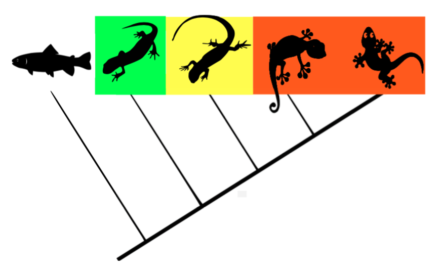
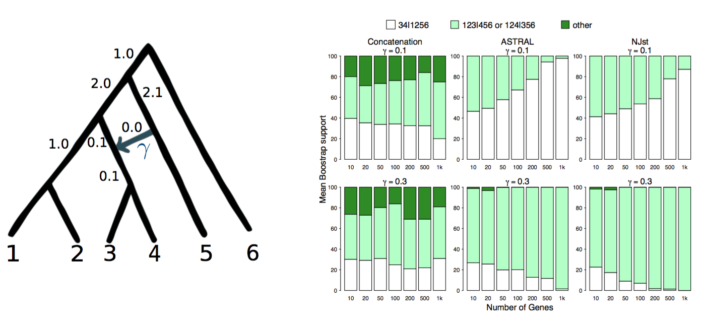
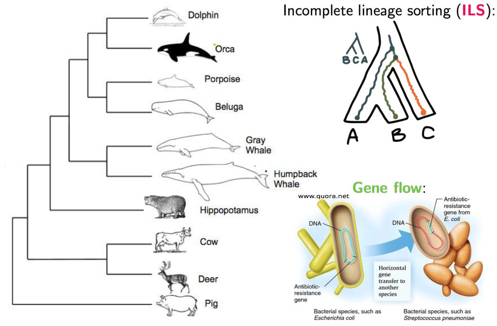
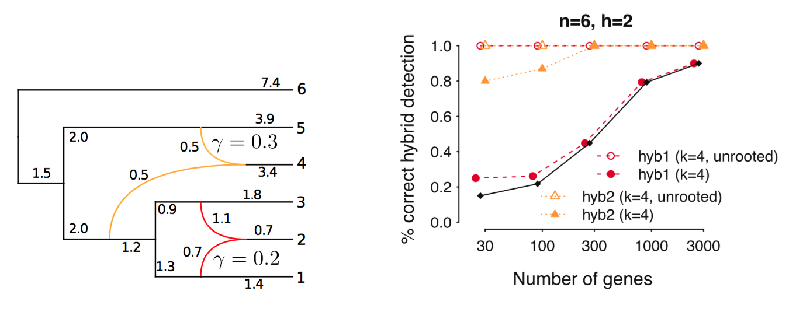

  

      <ul class="nav">
          <li><a href="https://github.com/crsl4/crsl4.github.io/blob/master/assets/cv.pdf">cv</a></li>
          <li><a href="https://github.com/crsl4">github</a></li>
          <li><a href="https://scholar.google.com/citations?user=GrUypj8AAAAJ&hl=en&oi=ao">google-scholar</a></li>
          <li><a href="https://www.linkedin.com/in/claudia-solis-lemus-b64069122">linkedin</a></li>
          <li><a href="https://www.athlinks.com/athletes/267606489">athlinks</a></li>
      </ul>
  

<table class="wide">
<tr>
  <td class="left">
    
  </td>
  <td class="right">
    
  </td>
</tr>
<tr>
  <td class="left">
    
  </td>
  <td class="right">
    
  </td>
</tr>
</table>

