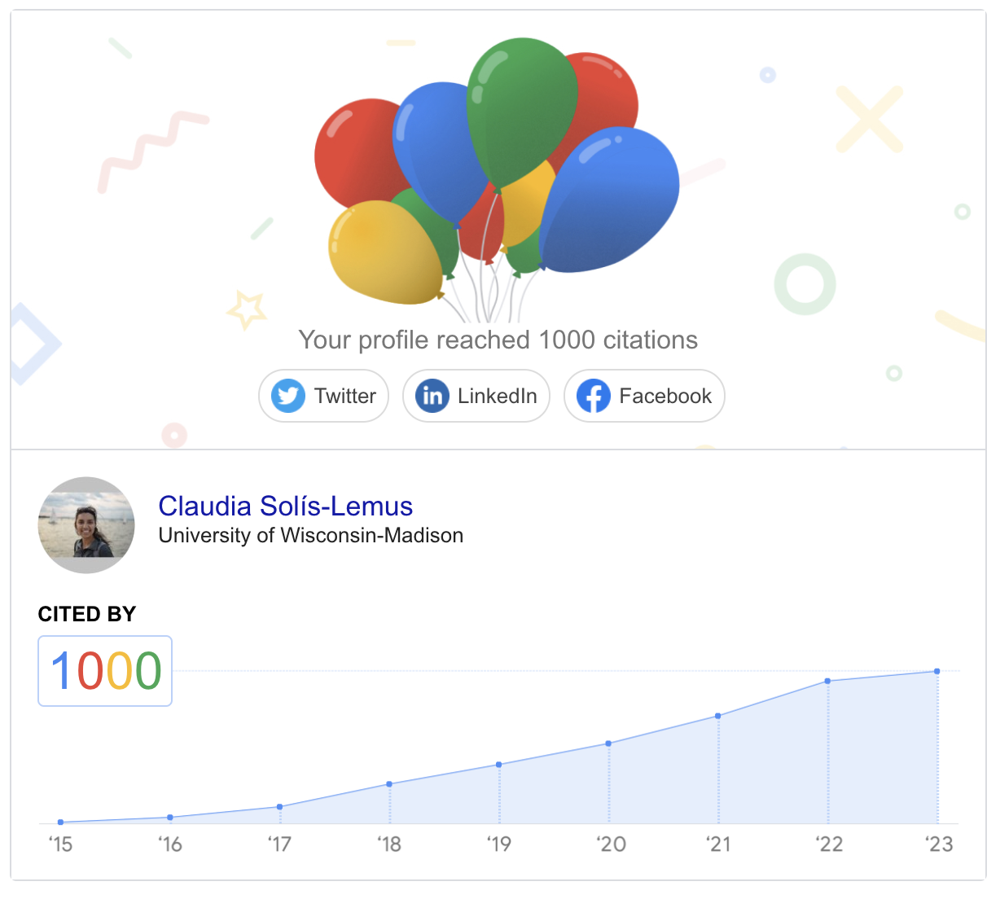
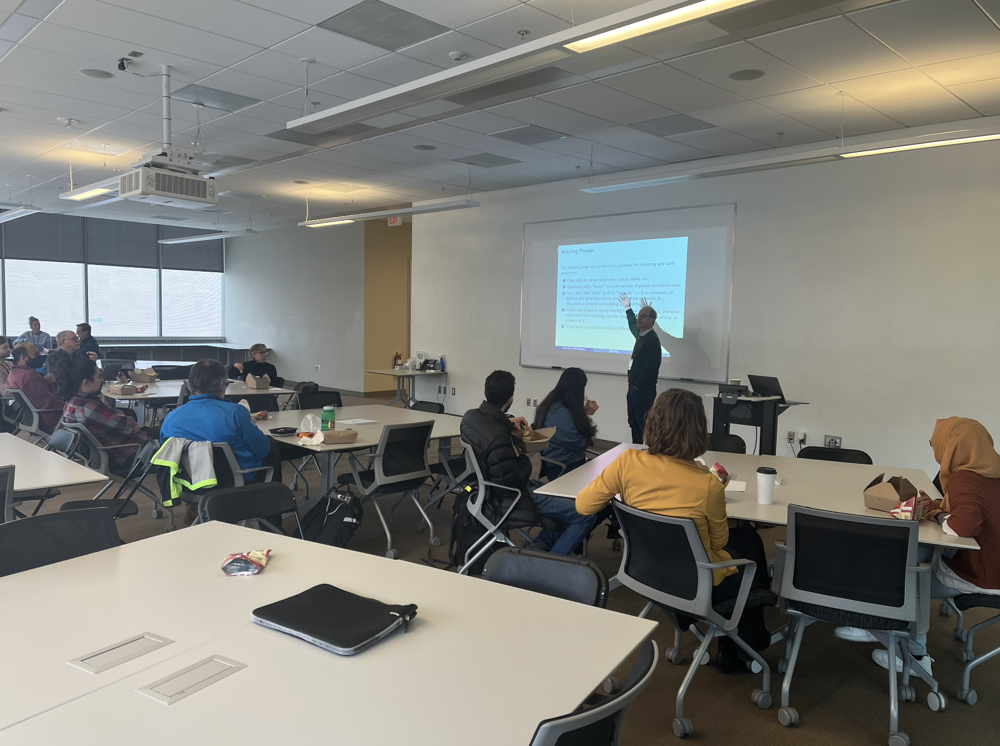
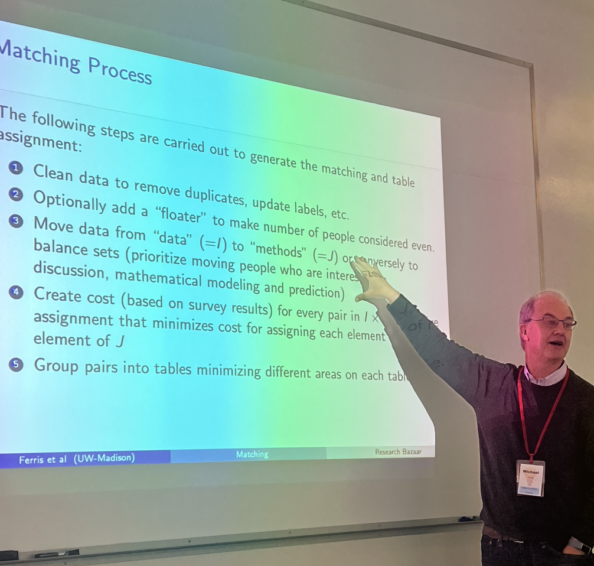

### 2023

- Thank you to the Data Science Hub for featuring me in the "Faces of Data Science" edition. See [here](https://datascience.wisc.edu/#faces) for the article.

<blockquote class="twitter-tweet">
Claudia Solís-Lemus collaborates with life sciences researchers, developing mathematical models to help them understand relationships and interactions among species. Read her story in Faces of Data Science. <a href="https://twitter.com/solislemuslab?ref_src=twsrc%5Etfw">@solislemuslab</a> <a href="https://twitter.com/UWMadisonCALS?ref_src=twsrc%5Etfw">@uwmadisoncals</a> <a href="https://twitter.com/WIDiscovery?ref_src=twsrc%5Etfw">@widiscovery</a> <a href="https://t.co/B6shjQY6X3">https://t.co/B6shjQY6X3</a> <a href="https://t.co/iIaVlb8YbU">pic.twitter.com/iIaVlb8YbU</a>
&mdash; datascience@uw (@datascience_uw) <a href="https://twitter.com/datascience_uw/status/1664278126673948679?ref_src=twsrc%5Etfw">June 1, 2023</a></blockquote> 

- Do you identify as Latinx in Data Science? We are excited to launch the #LatinxInDataSci database: [https://latinxinstat.wid.wisc.edu/](https://latinxinstat.wid.wisc.edu/). Please add yourself! Also, conference organizers can use this database to include a more diverse representation of speakers.

- Gracias Ricardo por la invitacion para hablar de mi trayectoria en ciencia:

<blockquote class="twitter-tweet">
Hoy tuvimos la visita de la súper genial <a href="https://twitter.com/solislemuslab?ref_src=twsrc%5Etfw">@solislemuslab</a> Les alumnes súper pilas con las redes filogenéticas pero además no las condiciones para les latines haciendo ciencia en EEUU ....no se pierdan el video por <a href="https://twitter.com/hashtag/SisteMatrix?src=hash&amp;ref_src=twsrc%5Etfw">#SisteMatrix</a>!!! <a href="https://t.co/Mt4cfvEnLK">pic.twitter.com/Mt4cfvEnLK</a>
&mdash; Ricardo (@rgarciasandoval) <a href="https://twitter.com/rgarciasandoval/status/1653815670994264095?ref_src=twsrc%5Etfw">May 3, 2023</a></blockquote> 

- Very excited to have reached 1000 citations on Google Scholar!

- Thankful for the advertisement on El Zoominario:

<blockquote class="twitter-tweet">
El Zoominario is an online seminar series that highlights Latinx speakers and their science. The program, co-created by plant pathology&#39;s Claudia Solís-Lemus, is designed for the general public and aims to inspire young scientists. <a href="https://t.co/cgdn3PqyOJ">https://t.co/cgdn3PqyOJ</a> <a href="https://t.co/tK86vfSY0F">pic.twitter.com/tK86vfSY0F</a>
&mdash; UW-Madison CALS (@UWMadisonCALS) <a href="https://twitter.com/UWMadisonCALS/status/1628426955254120448?ref_src=twsrc%5Etfw">February 22, 2023</a></blockquote> 

- Excited to join the [Journal of Open Source Software (JOSS)](https://joss.theoj.org/) editorial team!

- A lot of fun in the Collaboration Matching experiment at the WID Research Bazaar 2023! Thanks to Sarah Stevens, Chris Endemann and Michael Ferris (in the photo below):

- Thanks for the invitation to speak at a [Girls Who Code](http://websites.umich.edu/~girlswc/) event!

- [Great article](https://cgsi.wisc.edu/2023/01/23/el-zoominario/) about El Zoominario, posted in Genomics & Technology Spring 2023. Thanks!

### 2022

- Launching the #LatinxInStat database!!!

<blockquote class="twitter-tweet">
Launching the <a href="https://twitter.com/hashtag/LatinxInStat?src=hash&amp;ref_src=twsrc%5Etfw">#LatinxInStat</a> <a href="https://twitter.com/hashtag/LatinxInDataSci?src=hash&amp;ref_src=twsrc%5Etfw">#LatinxInDataSci</a> database <a href="https://twitter.com/AmstatNews?ref_src=twsrc%5Etfw">@AmstatNews</a> <a href="https://twitter.com/WIDiscovery?ref_src=twsrc%5Etfw">@WIDiscovery</a> <a href="https://twitter.com/WomenInStat?ref_src=twsrc%5Etfw">@WomenInStat</a> 🪅  Latinx in stat/DS/ML, please add yourself to the database: <a href="https://t.co/Nue3QCWjrL">https://t.co/Nue3QCWjrL</a>  All, please use this db for a more diverse representation of speakers when organizing conferences😊 <a href="https://t.co/EjkSzulOo4">https://t.co/EjkSzulOo4</a>
&mdash; Claudia Solís-Lemus (@solislemuslab) <a href="https://twitter.com/solislemuslab/status/1579913349319766016?ref_src=twsrc%5Etfw">October 11, 2022</a></blockquote> 

- Launching the @latinxinstem TikTok account to promote Latinx scientists and to promote El Zoominario:

<blockquote class="tiktok-embed" cite="https://www.tiktok.com/@latinxinstem/video/7083991804441578798" data-video-id="7083991804441578798" style="max-width: 605px;min-width: 325px;" > <section> <a target="_blank" title="@latinxinstem" href="https://www.tiktok.com/@latinxinstem">@latinxinstem</a> Visibility of <a title="latinxinstem" target="_blank" href="https://www.tiktok.com/tag/latinxinstem">#LatinxInSTEM</a> <a title="elzoominario" target="_blank" href="https://www.tiktok.com/tag/elzoominario">#elzoominario</a> <a target="_blank" title="♬ Surfin&#39; U.S.A. - The Beach Boys" href="https://www.tiktok.com/music/SurfinUSA-6750951406850557953">♬ Surfin&#39; U.S.A. - The Beach Boys</a> </section> </blockquote> 

- I write to inform all that George Tiley and I resigned to the position of editor of the Frontiers Rising Stars in Reticulate Evolution special edition.

<blockquote class="twitter-tweet">
In Jan, I was excited to invite people to the Frontiers Rising Stars ⭐️ special edition on reticulate evolution that I was co-editing with George Tiley (no twitter). Unfortunately, George and I grew tired of some bizarre editorial practices in Frontiers. 1/3 <a href="https://t.co/gO2paPoxTP">https://t.co/gO2paPoxTP</a>
&mdash; Claudia Solís-Lemus (@solislemuslab) <a href="https://twitter.com/solislemuslab/status/1511838083863490566?ref_src=twsrc%5Etfw">April 6, 2022</a></blockquote> 

- Incredibly grateful to receive an [NSF CAREER award](https://www.nsf.gov/awardsearch/showAward?AWD_ID=2144367&HistoricalAwards=false)!

<blockquote class="twitter-tweet">
Incredibly grateful that my NSF CAREER &quot;Towards Scalable and Robust Inference of Phylogenetic Networks&quot; will be funded 🥳🎉. New positions available in the lab soon! <a href="https://twitter.com/hashtag/newPI?src=hash&amp;ref_src=twsrc%5Etfw">#newPI</a>
&mdash; Claudia Solís-Lemus (@solislemuslab) <a href="https://twitter.com/solislemuslab/status/1486051077216735232?ref_src=twsrc%5Etfw">January 25, 2022</a></blockquote> 

- Thanks for the [WID news on my NSF CAREER award](https://wid.wisc.edu/claudia-solis-lemus-receives-nsf-career-award/)!

- Thanks to Frontiers for asking me to co-edit this special edition on [Rising Stars in Phylogenetics, Phylogenomics, and Systematics: Reticulate Patterns and Processes of Molecular Evolution](https://www.frontiersin.org/research-topics/29769/rising-stars-in-phylogenetics-phylogenomics-and-systematics-reticulate-patterns-and-processes-of-mol) with George Tiley. People who are ECRs and work on phylogenetic networks should consider participating!

### 2021

- Thanks to [@mujeres.haciendo.ciencia](https://www.instagram.com/mujeres.haciendo.ciencia/) for inviting me to publish about me and about my work. Very honored!

<blockquote class="instagram-media" data-instgrm-captioned data-instgrm-permalink="https://www.instagram.com/p/CXhCBNyNFug/?utm_source=ig_embed&amp;utm_campaign=loading" data-instgrm-version="14" style=" background:#FFF; border:0; border-radius:3px; box-shadow:0 0 1px 0 rgba(0,0,0,0.5),0 1px 10px 0 rgba(0,0,0,0.15); margin: 1px; max-width:540px; min-width:326px; padding:0; width:99.375%; width:-webkit-calc(100% - 2px); width:calc(100% - 2px);">
 <a href="https://www.instagram.com/p/CXhCBNyNFug/?utm_source=ig_embed&amp;utm_campaign=loading" style=" background:#FFFFFF; line-height:0; padding:0 0; text-align:center; text-decoration:none; width:100%;" target="_blank"> 
 

 
 

 

 
<svg width="50px" height="50px" viewBox="0 0 60 60" version="1.1" xmlns="https://www.w3.org/2000/svg" xmlns:xlink="https://www.w3.org/1999/xlink"><g stroke="none" stroke-width="1" fill="none" fill-rule="evenodd"><g transform="translate(-511.000000, -20.000000)" fill="#000000"><g><path d="M556.869,30.41 C554.814,30.41 553.148,32.076 553.148,34.131 C553.148,36.186 554.814,37.852 556.869,37.852 C558.924,37.852 560.59,36.186 560.59,34.131 C560.59,32.076 558.924,30.41 556.869,30.41 M541,60.657 C535.114,60.657 530.342,55.887 530.342,50 C530.342,44.114 535.114,39.342 541,39.342 C546.887,39.342 551.658,44.114 551.658,50 C551.658,55.887 546.887,60.657 541,60.657 M541,33.886 C532.1,33.886 524.886,41.1 524.886,50 C524.886,58.899 532.1,66.113 541,66.113 C549.9,66.113 557.115,58.899 557.115,50 C557.115,41.1 549.9,33.886 541,33.886 M565.378,62.101 C565.244,65.022 564.756,66.606 564.346,67.663 C563.803,69.06 563.154,70.057 562.106,71.106 C561.058,72.155 560.06,72.803 558.662,73.347 C557.607,73.757 556.021,74.244 553.102,74.378 C549.944,74.521 548.997,74.552 541,74.552 C533.003,74.552 532.056,74.521 528.898,74.378 C525.979,74.244 524.393,73.757 523.338,73.347 C521.94,72.803 520.942,72.155 519.894,71.106 C518.846,70.057 518.197,69.06 517.654,67.663 C517.244,66.606 516.755,65.022 516.623,62.101 C516.479,58.943 516.448,57.996 516.448,50 C516.448,42.003 516.479,41.056 516.623,37.899 C516.755,34.978 517.244,33.391 517.654,32.338 C518.197,30.938 518.846,29.942 519.894,28.894 C520.942,27.846 521.94,27.196 523.338,26.654 C524.393,26.244 525.979,25.756 528.898,25.623 C532.057,25.479 533.004,25.448 541,25.448 C548.997,25.448 549.943,25.479 553.102,25.623 C556.021,25.756 557.607,26.244 558.662,26.654 C560.06,27.196 561.058,27.846 562.106,28.894 C563.154,29.942 563.803,30.938 564.346,32.338 C564.756,33.391 565.244,34.978 565.378,37.899 C565.522,41.056 565.552,42.003 565.552,50 C565.552,57.996 565.522,58.943 565.378,62.101 M570.82,37.631 C570.674,34.438 570.167,32.258 569.425,30.349 C568.659,28.377 567.633,26.702 565.965,25.035 C564.297,23.368 562.623,22.342 560.652,21.575 C558.743,20.834 556.562,20.326 553.369,20.18 C550.169,20.033 549.148,20 541,20 C532.853,20 531.831,20.033 528.631,20.18 C525.438,20.326 523.257,20.834 521.349,21.575 C519.376,22.342 517.703,23.368 516.035,25.035 C514.368,26.702 513.342,28.377 512.574,30.349 C511.834,32.258 511.326,34.438 511.181,37.631 C511.035,40.831 511,41.851 511,50 C511,58.147 511.035,59.17 511.181,62.369 C511.326,65.562 511.834,67.743 512.574,69.651 C513.342,71.625 514.368,73.296 516.035,74.965 C517.703,76.634 519.376,77.658 521.349,78.425 C523.257,79.167 525.438,79.673 528.631,79.82 C531.831,79.965 532.853,80.001 541,80.001 C549.148,80.001 550.169,79.965 553.369,79.82 C556.562,79.673 558.743,79.167 560.652,78.425 C562.623,77.658 564.297,76.634 565.965,74.965 C567.633,73.296 568.659,71.625 569.425,69.651 C570.167,67.743 570.674,65.562 570.82,62.369 C570.966,59.17 571,58.147 571,50 C571,41.851 570.966,40.831 570.82,37.631"></path></g></g></g></svg>

 
View this post on Instagram

 

 

 

 

 

 

 

 

 

 
 

 

</a>
<a href="https://www.instagram.com/p/CXhCBNyNFug/?utm_source=ig_embed&amp;utm_campaign=loading" style=" color:#c9c8cd; font-family:Arial,sans-serif; font-size:14px; font-style:normal; font-weight:normal; line-height:17px; text-decoration:none;" target="_blank">A post shared by Mulheres Fazendo Ciência (@mujeres.haciendo.ciencia)</a>

</blockquote> 

- Thanks to Nadya from WORT radio program "En Nuestro Patio" for interviewing me about my efforts in science communication and diversity in STEM. People can listen to the recording in the "Audio Archives" of Tuesday November 16th, 2021 7pm CT [here](https://www.wortfm.org/)

- Thanks to PBS Meet the Lab for featuring the Solis-Lemus lab as [Data Decoders](https://pbswisconsineducation.org/lab/data-decoders/)

- Thanks to [Delta Beer Lab](https://www.delta.beer/) for hosting my talk at the [WI Science Festival](https://www.wisconsinsciencefest.org/). Details of the talk [here](https://www.wisconsinsciencefest.org/event/the-adventure-of-the-statisticians-rule-of-thumb/)

- Thanks [@WomenInStat](https://twitter.com/WomenInStat?ref_src=twsrc%5Egoogle%7Ctwcamp%5Eserp%7Ctwgr%5Eauthor) for inviting me to curate the twitter account the week of Sept 13-17, 2021

<blockquote class="twitter-tweet">
This week, our <a href="https://twitter.com/hashtag/RoCur?src=hash&amp;ref_src=twsrc%5Etfw">#RoCur</a> is <a href="https://twitter.com/solislemuslab?ref_src=twsrc%5Etfw">@solislemuslab</a> of <a href="https://twitter.com/UWMadison?ref_src=twsrc%5Etfw">@uwmadison</a>! <a href="https://twitter.com/hashtag/WSDS?src=hash&amp;ref_src=twsrc%5Etfw">#WSDS</a> <a href="https://twitter.com/hashtag/Statistics?src=hash&amp;ref_src=twsrc%5Etfw">#Statistics</a> <a href="https://twitter.com/hashtag/DataScience?src=hash&amp;ref_src=twsrc%5Etfw">#DataScience</a>  Claudia is an Assistant Professor whose research deals with modern <a href="https://twitter.com/hashtag/bigdata?src=hash&amp;ref_src=twsrc%5Etfw">#bigdata</a> which is highly interconnected through graphical structures.  💻 <a href="https://t.co/pQm2ZnpfFf">https://t.co/pQm2ZnpfFf</a> <a href="https://t.co/VMSgSUuMfJ">pic.twitter.com/VMSgSUuMfJ</a>
&mdash; Women in Statistics and Data Science (@WomenInStat) <a href="https://twitter.com/WomenInStat/status/1437385579038007300?ref_src=twsrc%5Etfw">September 13, 2021</a></blockquote> 

<blockquote class="twitter-tweet">
As Latinx in Stat, I want to focus today on Latinx visibility and amplifying Latinx voices. Excited to introduce <a href="https://twitter.com/hashtag/LatinxInStat?src=hash&amp;ref_src=twsrc%5Etfw">#LatinxInStat</a> <a href="https://twitter.com/hashtag/LatinxInDataSci?src=hash&amp;ref_src=twsrc%5Etfw">#LatinxInDataSci</a> 🎉🎉🎉  Please introduce yourself 👋 and tag others. Feel free to reply in any language. I&#39;ll start 👇
&mdash; Women in Statistics and Data Science (@WomenInStat) <a href="https://twitter.com/WomenInStat/status/1437404461635342342?ref_src=twsrc%5Etfw">September 13, 2021</a></blockquote> 

<blockquote class="twitter-tweet">
What I ❤️ about <a href="https://twitter.com/hashtag/JuliaLang?src=hash&amp;ref_src=twsrc%5Etfw">#JuliaLang</a>: It is fast, fast, fast! And so easy to create readable and efficient code.  Julia users, let&#39;s share the love and <a href="https://twitter.com/JuliaLanguage?ref_src=twsrc%5Etfw">@JuliaLanguage</a> resources for Data Science for the community!  I&#39;ll start 👇 <a href="https://t.co/idynpEAJq1">https://t.co/idynpEAJq1</a>
&mdash; Women in Statistics and Data Science (@WomenInStat) <a href="https://twitter.com/WomenInStat/status/1437837408951754762?ref_src=twsrc%5Etfw">September 14, 2021</a></blockquote> 

<blockquote class="twitter-tweet">
I am crazily obsessed with <a href="https://twitter.com/hashtag/reproducibility?src=hash&amp;ref_src=twsrc%5Etfw">#reproducibility</a> and good computing/datasci practices. Who is with me? 👋  Today, let&#39;s all share resources on how to be more reproducible!  I&#39;ll start 🧵👇 <a href="https://t.co/FGldfw5Pdl">https://t.co/FGldfw5Pdl</a>
&mdash; Women in Statistics and Data Science (@WomenInStat) <a href="https://twitter.com/WomenInStat/status/1438157250762264577?ref_src=twsrc%5Etfw">September 15, 2021</a></blockquote> 

<blockquote class="twitter-tweet">
Day 1: <a href="https://twitter.com/hashtag/LatinxInStat?src=hash&amp;ref_src=twsrc%5Etfw">#LatinxInStat</a> <a href="https://twitter.com/hashtag/LatinxInDataSci?src=hash&amp;ref_src=twsrc%5Etfw">#LatinxInDataSci</a> visibility ✔️ Day 2: <a href="https://twitter.com/hashtag/JuliaLang?src=hash&amp;ref_src=twsrc%5Etfw">#JuliaLang</a> for DataSci ✔️ Day 3: <a href="https://twitter.com/hashtag/Reproducibility?src=hash&amp;ref_src=twsrc%5Etfw">#Reproducibility</a> and best computing practices ✔️  Today, which person are you? a. I love graphical abstracts b. I hate graphical abstracts c. What are graphical abstracts?
&mdash; Women in Statistics and Data Science (@WomenInStat) <a href="https://twitter.com/WomenInStat/status/1438502731983949832?ref_src=twsrc%5Etfw">September 16, 2021</a></blockquote> 

<blockquote class="twitter-tweet">
Today is complaint day! As interdisciplinary stat, I get rejected a lot: &quot;not real stat&quot; for stat journals; &quot;too math-y&quot; for domain journals.  Anyone else has also felt in between? 👋  Let&#39;s share stories or strategies in the world of interdisciplinary stat!  I&#39;ll start 👇 <a href="https://t.co/YYw8pQRTVC">https://t.co/YYw8pQRTVC</a>
&mdash; Women in Statistics and Data Science (@WomenInStat) <a href="https://twitter.com/WomenInStat/status/1438899265913380874?ref_src=twsrc%5Etfw">September 17, 2021</a></blockquote> 

<blockquote class="twitter-tweet">
Thanks for a great week! Day 1: <a href="https://twitter.com/hashtag/LatinxInStat?src=hash&amp;ref_src=twsrc%5Etfw">#LatinxInStat</a> visibility Day 2: <a href="https://twitter.com/hashtag/JuliaLang?src=hash&amp;ref_src=twsrc%5Etfw">#JuliaLang</a> for DataSci Day 3: <a href="https://twitter.com/hashtag/Reproducibility?src=hash&amp;ref_src=twsrc%5Etfw">#Reproducibility</a> &amp; computing practices Day 4: Sci comm practices Day 5: The in-betweenness of interdisciplinary stat  On our last day, let&#39;s open the floor to connect as community
&mdash; Women in Statistics and Data Science (@WomenInStat) <a href="https://twitter.com/WomenInStat/status/1439232952429424642?ref_src=twsrc%5Etfw">September 18, 2021</a></blockquote> 

<blockquote class="twitter-tweet">
Thank you all for a great week <a href="https://twitter.com/WomenInStat?ref_src=twsrc%5Etfw">@WomenInStat</a>! Let&#39;s keep our <a href="https://twitter.com/hashtag/LatinxInStat?src=hash&amp;ref_src=twsrc%5Etfw">#LatinxInStat</a> and <a href="https://twitter.com/hashtag/LatinxInDataSci?src=hash&amp;ref_src=twsrc%5Etfw">#LatinxInDataSci</a> community connected! I will initiate the creation a database for us all in coordination with <a href="https://twitter.com/_Rob_Santos?ref_src=twsrc%5Etfw">@_Rob_Santos</a> and <a href="https://twitter.com/AmstatNews?ref_src=twsrc%5Etfw">@AmstatNews</a>. Stay tuned (and patient, it might be slow)! Gracias 😊 <a href="https://t.co/0wJpxclntK">https://t.co/0wJpxclntK</a>
&mdash; Women in Statistics and Data Science (@WomenInStat) <a href="https://twitter.com/WomenInStat/status/1439591356385710081?ref_src=twsrc%5Etfw">September 19, 2021</a></blockquote> 

- Gracias ClubEcoEvo Latinoamérica por la invitación a dar una platica (en español) de mi investigación: [YouTube](https://www.youtube.com/watch?v=PKXf1W4bocQ)

- Two talks at [JuliaCon2021](https://pretalx.com/juliacon2021/schedule/) from the lab:
    - [PhyloNetworks.jl](https://pretalx.com/juliacon2021/speaker/GRHU7U/) led by me
    - [Bayesian Network Regression](https://pretalx.com/juliacon2021/speaker/X8DQ9H/) led by Sam Ozminkowski

- Thanks GROW magazine for featuring me in an article in the [Summer 2021 edition](https://grow.cals.wisc.edu/departments/living-science/the-tree-of-life-is-rooted-in-math)!

- Thanks WID for featuring me in the #WomenHistoryMonth 1-minute chats on [YouTube](https://www.youtube.com/watch?v=agnLh41aEfg)

- Thank you for inviting me to join the Editorial Board of Phylogenetics, Phylogenomics, and Systematics as Review Editor for Frontiers in Ecology and Evolution

- The Solis-Lemus lab helped plant 5 trees by holding lab meetings in [whereby](https://whereby.com/org/signup) in February!

- Short tutorial for WI Fast Stats on [YouTube](https://youtu.be/6vX3mVXcK4s)

- Julia workshop for Data Science co-organized with Doug Bates for the [2021 Data Science Research Bazaar](https://datascience.wisc.edu/data-science-research-bazaar/) on February 10th, 2021. [GitHub](https://github.com/crsl4/julia-workshop)

- Thanks to [Casey Dunn](http://dunnlab.org/) for inviting me to participate in his code conversations! Here is the [YouTube link](https://www.youtube.com/watch?v=Byhc0tksgSk)

- Student poll during my [phylogenetic class](https://github.com/crsl4/phylogenetics-class): what software have you used? (January 26, 2021)

### 2020

- The SNaQ paper (Solis-Lemus et al, 2017) was included in the PLOS Genetics Top 10% curated collection!

- Julia workshop for Data Science organized by CIMAT on October 26-27, 2020. Thank you Leticia Ramirez for inviting me! Details [here](http://mcd.eventos.cimat.mx/)

- Thank you Cedarburg Public library for inviting me to give a talk at the [NEA Big Read: Ozaukee County 2020](https://cedarburglibrary.org/connect/cedarburg-friends-of-the-library/cedarburg-reads/)

- Excited to see my project summary in the list of 2020 awards for the DOE Computational Tool Development for Integrative Systems Biology Data Analysis [here](https://genomicscience.energy.gov/compbio/2020Awards.shtml) and awards brochure PDF [here](https://genomicscience.energy.gov/research/funding.shtml)

- We are launching [El Zoominario](https://solislemuslab.github.io/pages/talks.html#zoominario)! Thanks eCALS for the [news](https://ecals.cals.wisc.edu/2020/09/21/new-seminar-series-to-feature-short-scientific-talks-by-latinx-researchers/) to advertise it!

- Recruiting a postdoc! Details [here](https://jobrxiv.org/job/university-of-wisconsin-madison-27778-postdoctoral-researcher-in-statistical-machine-learning-methods-for-high-dimensional-omics-data-2/). To apply, send me an email with CV, short research statement (<=1 page), and github username. Subject "Postdoc application".

- Grateful to receive [DOE award](https://science.osti.gov/-/media/ber/pdf/Awards/Computational_Tool_Development_List_of_Awards-DE-FOA-0002217.pdf?la=en&hash=F863703E5FA6B0889E8F29BF791312F4310B9629) for computational biology tools! See the [WID News](https://wid.wisc.edu/solis-lemus-awarded-grant-to-develop-statistical-theory-for-soil-data/). I will be recruiting a postdoc soon!

- Thanks for the invitation to give a talk at the [1st virtual meeting of Systematics, Biogeography and Evolution (SBE)](https://www.eventbrite.com.ar/e/first-virtual-meeting-of-systematic-biogeography-evolution-sbe-tickets-106645918814) on phylogenetic networks. See talk [here](https://www.youtube.com/watch?v=4ByqoDnpVew)

- Thank you to Deisy Angarita and Andres Cuervo from Universidad Nacional de Colombia for inviting me to their phylogenetics class (via zoom)!

- Congratulations to Zhaoyi Zhang for winning the Hilldale Faculty/Undergraduate Research Fellowship of UW-Madison!

- Honored to have been elected to become part of the SSB Council! My 3-year term as Council member will start on January 2021

- Thanks to Mackenzie Krumme for the [article about me](https://www.uwalumni.com/news/the-flip-of-a-coin/) at the Wisconsin Alumni Association website

- Excited to join the [Badger Talks](https://badgertalks.wisc.edu/speaker/claudia-solis-lemus/)

### 2019

- Thanks eCALS for my [new faculty profile](https://ecals.cals.wisc.edu/2019/10/09/new-faculty-profile-claudia-solis-lemus-develops-statistical-models-to-answer-biological-questions/)

- Launching my Wisconsin Institute for Discovery [website](https://wid.wisc.edu/people/claudia-solis-lemus/)