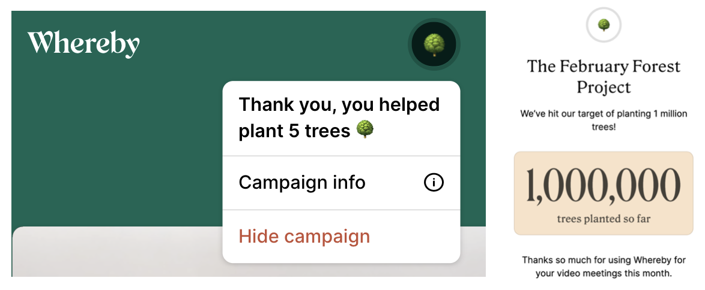
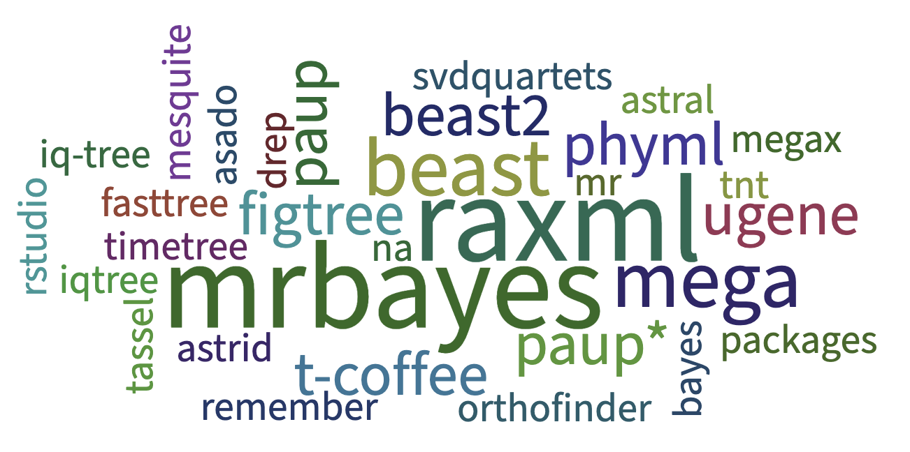

### Upcoming

### 2021

- Thanks GROW magazine for featuring me in an article in the [Summer 2021 edition](https://grow.cals.wisc.edu/departments/living-science/the-tree-of-life-is-rooted-in-math)!

- Thanks WID for featuring me in the #WomenHistoryMonth 1-minute chats on [YouTube](https://www.youtube.com/watch?v=agnLh41aEfg)

- Thank you for inviting me to join the Editorial Board of Phylogenetics, Phylogenomics, and Systematics as Review Editor for Frontiers in Ecology and Evolution

- The Solis-Lemus lab helped plant 5 trees by holding lab meetings in [whereby](https://whereby.com/org/signup) in February!

- Short tutorial for WI Fast Stats on [YouTube](https://youtu.be/6vX3mVXcK4s)

- Julia workshop for Data Science co-organized with Doug Bates for the [2021 Data Science Research Bazaar](https://datascience.wisc.edu/data-science-research-bazaar/) on February 10th, 2021. [GitHub](https://github.com/crsl4/julia-workshop)

- Thanks to [Casey Dunn](http://dunnlab.org/) for inviting me to participate in his code conversations! Here is the [YouTube link](https://www.youtube.com/watch?v=Byhc0tksgSk)

- Student poll during my [phylogenetic class](https://github.com/crsl4/phylogenetics-class): what software have you used? (January 26, 2021)

### 2020

- The SNaQ paper (Solis-Lemus et al, 2017) was included in the PLOS Genetics Top 10% curated collection!

- Julia workshop for Data Science organized by CIMAT on October 26-27, 2020. Thank you Leticia Ramirez for inviting me! Details [here](http://mcd.eventos.cimat.mx/)

- Thank you Cedarburg Public library for inviting me to give a talk at the [NEA Big Read: Ozaukee County 2020](https://cedarburglibrary.org/connect/cedarburg-friends-of-the-library/cedarburg-reads/)

- Excited to see my project summary in the list of 2020 awards for the DOE Computational Tool Development for Integrative Systems Biology Data Analysis [here](https://genomicscience.energy.gov/compbio/2020Awards.shtml) and awards brochure PDF [here](https://genomicscience.energy.gov/research/funding.shtml)

- We are launching [El Zoominario](https://solislemuslab.github.io/pages/talks.html#zoominario)! Thanks eCALS for the [news](https://ecals.cals.wisc.edu/2020/09/21/new-seminar-series-to-feature-short-scientific-talks-by-latinx-researchers/) to advertise it!

- Recruiting a postdoc! Details [here](https://jobrxiv.org/job/university-of-wisconsin-madison-27778-postdoctoral-researcher-in-statistical-machine-learning-methods-for-high-dimensional-omics-data-2/). To apply, send me an email with CV, short research statement (<=1 page), and github username. Subject "Postdoc application".

- Grateful to receive [DOE award](https://science.osti.gov/-/media/ber/pdf/Awards/Computational_Tool_Development_List_of_Awards-DE-FOA-0002217.pdf?la=en&hash=F863703E5FA6B0889E8F29BF791312F4310B9629) for computational biology tools! See the [WID News](https://wid.wisc.edu/solis-lemus-awarded-grant-to-develop-statistical-theory-for-soil-data/). I will be recruiting a postdoc soon!

- Thanks for the invitation to give a talk at the [1st virtual meeting of Systematics, Biogeography and Evolution (SBE)](https://www.eventbrite.com.ar/e/first-virtual-meeting-of-systematic-biogeography-evolution-sbe-tickets-106645918814) on phylogenetic networks. See talk [here](https://www.youtube.com/watch?v=4ByqoDnpVew)

- Thank you to Deisy Angarita and Andres Cuervo from Universidad Nacional de Colombia for inviting me to their phylogenetics class (via zoom)!

- Congratulations to Zhaoyi Zhang for winning the Hilldale Faculty/Undergraduate Research Fellowship of UW-Madison!

- Honored to have been elected to become part of the SSB Council! My 3-year term as Council member will start on January 2021

- Thanks to Mackenzie Krumme for the [article about me](https://www.uwalumni.com/news/the-flip-of-a-coin/) at the Wisconsin Alumni Association website

- Excited to join the [Badger Talks](https://badgertalks.wisc.edu/speaker/claudia-solis-lemus/)

### 2019

- Thanks eCALS for my [new faculty profile](https://ecals.cals.wisc.edu/2019/10/09/new-faculty-profile-claudia-solis-lemus-develops-statistical-models-to-answer-biological-questions/)

- Launching my Wisconsin Institute for Discovery [website](https://wid.wisc.edu/people/claudia-solis-lemus/)