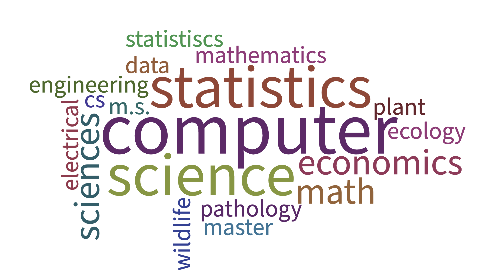
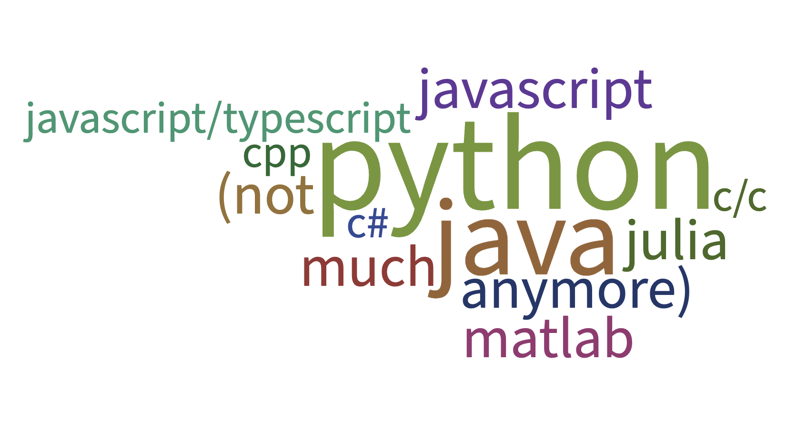
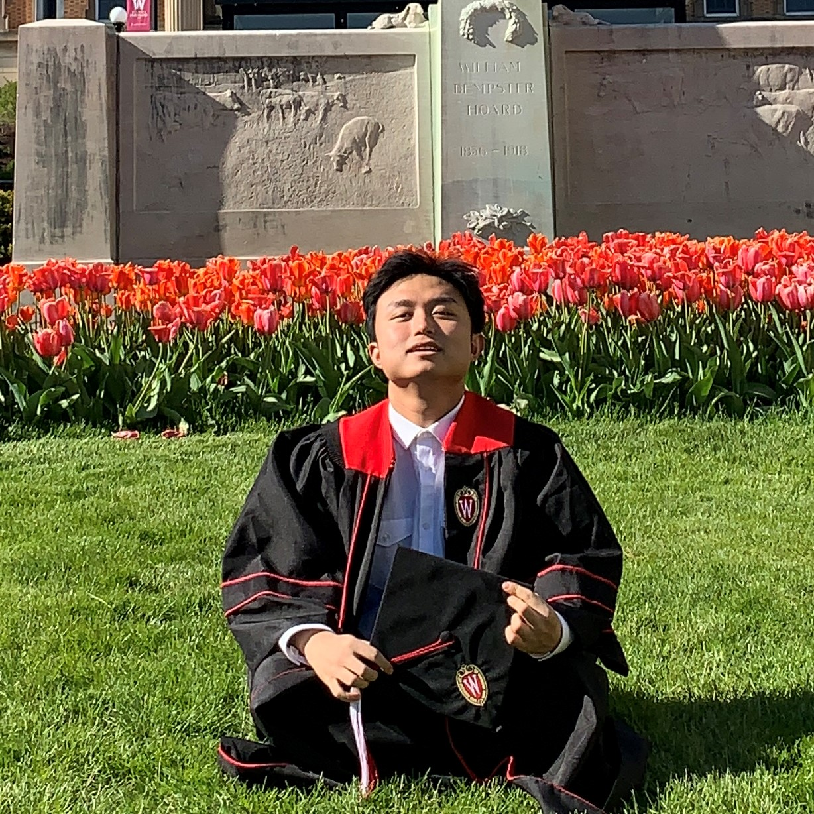
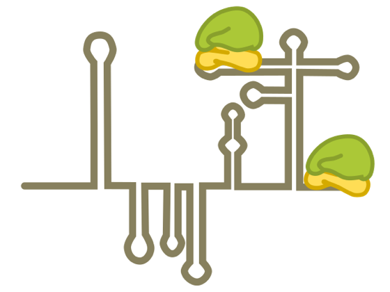
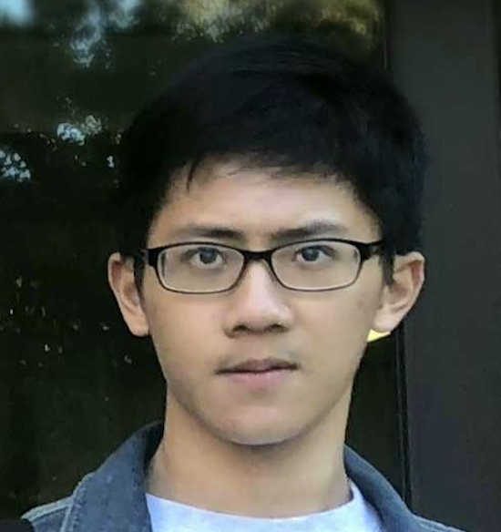
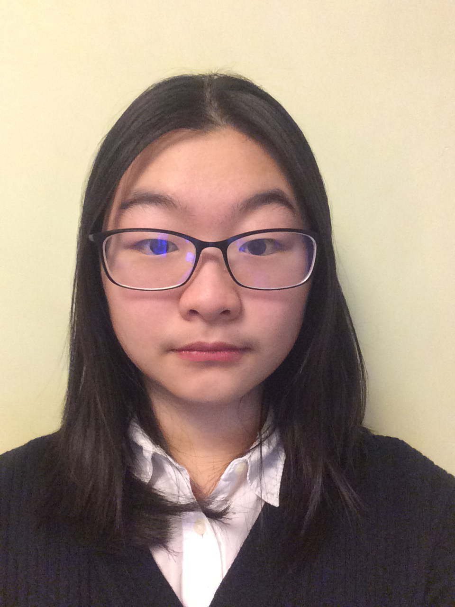
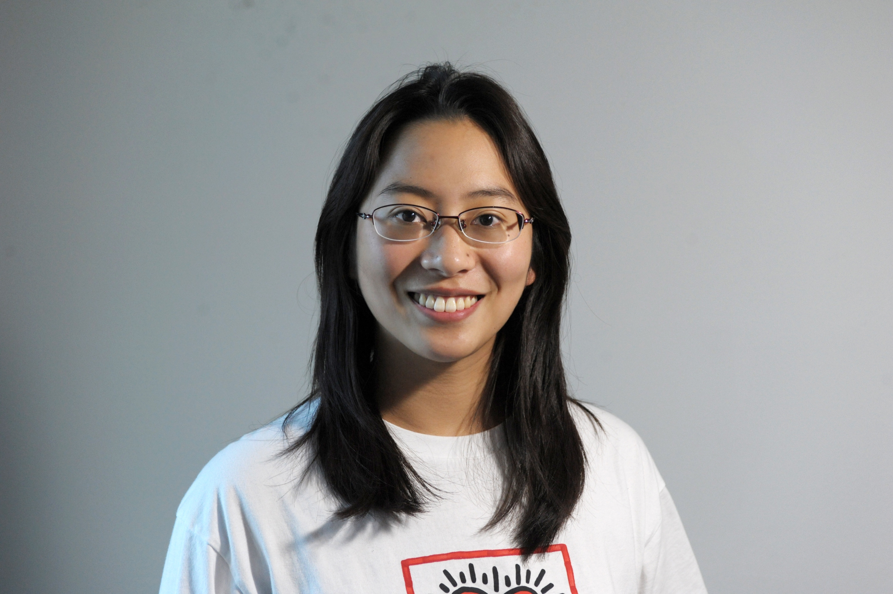
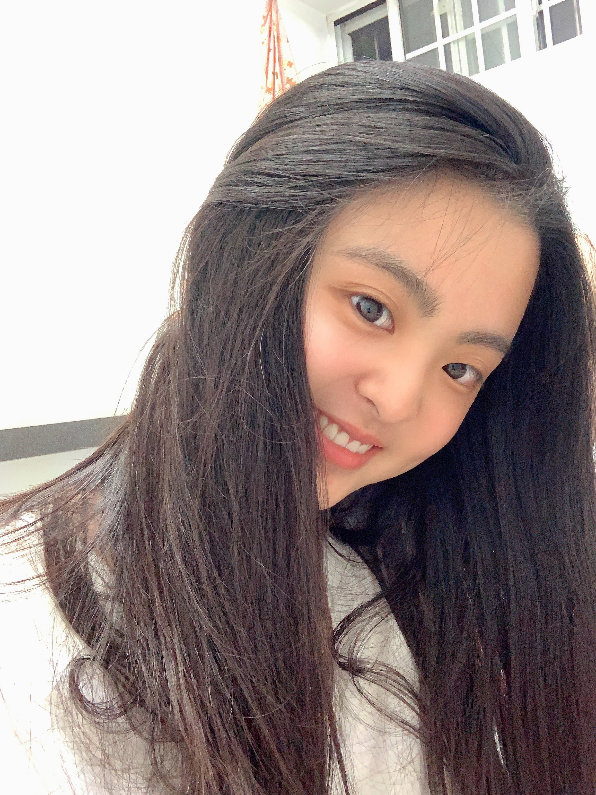
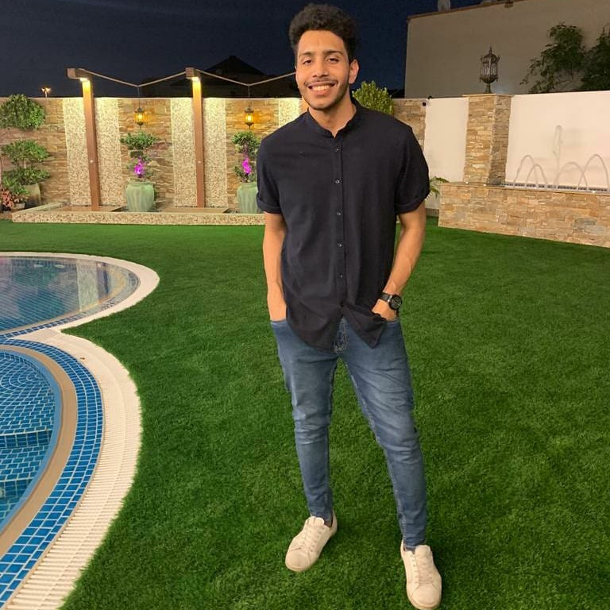

    

        <ul class="nav">
            <li><a href="#postdocs">postdocs</a></li>
            <li><a href="#graduate">graduate</a></li>
            <li><a href="#undergraduate">undergraduate</a></li>
            <li><a href="#past">past</a></li>
            <li><a href="#opportunities">oppportunities</a></li>
        </ul>
    

### Lab composition

    
    
    

---

### Claudia Sol&iacute;s-Lemus

I am an assistant professor at the [Wisconsin Institute for Discovery](https://wid.wisc.edu/) and the [Department of Plant Pathology](https://plantpath.wisc.edu/) at the [University of Wisconsin-Madison](http://www.wisc.edu). Originally from Mexico City, I did my Undergraduate degrees
in Actuarial Sciences and Applied Mathematics at [ITAM](https://www.itam.mx/en).
Then, I did a MA in [Mathematics](http://www.math.wisc.edu) and a PhD in [Statistics](http://www.stat.wisc.edu) at the [University of Wisconsin-Madison](http://www.wisc.edu). In my spare time, I enjoy swimming, running, biking, climbing and yoga!

Pronouns: she/her

Name pronunciation: [namedrop.io/claudiasolislemus](https://namedrop.io/claudiasolislemus)

<button type="button" onclick="window.location.href='https://github.com/crsl4/crsl4.github.io/blob/master/assets/cv.pdf';">cv</button>
<button type="button" onclick="window.location.href='https://scholar.google.com/citations?user=GrUypj8AAAAJ&hl=en&oi=ao';">google scholar</button>
<button type="button" onclick="window.location.href='https://github.com/crsl4';">github</button>
<button type="button" onclick="window.location.href='https://www.athlinks.com/athletes/267606489';">athlinks</button>
<button type="button" onclick="window.location.href='https://crsl4.github.io/';">website</button>

    

        

            Office 3164 <a href="https://wid.wisc.edu/">Wisconsin Institute for Discovery </a> 
            Office 476 <a href="https://plantpath.wisc.edu/">Department of Plant Pathology </a> 
            <a href="https://www.wisc.edu/">University of Wisconsin-Madison</a> 
            Madison, WI 53715 
            Phone: (608) 316-4568 
            USA  

            

            Email: <code>sol</code><b>I</b><code>islemus</code><b>don't</b><code>@</code><b>want</b><code></code><b>spam!
            </b><code>w</code><b>So</b><code>i</code><b>please</b><code>s</code><b>leave
            </b><code>c</code><b>me</b><code>.</code><b>alone</b><code>e</code><b>!</b><code>du</code> 
            Twitter: <code>@</code><b>I</b><code>sol</code><b>don't</b><code>is</code><b>want</b><code></code><b>spam!
            </b><code>le</code><b>So</b><code>m</code><b>please</b><code>u</code><b>leave
            </b><code>s</code><b>me</b><code>l</code><b>alone</b><code>a</code><b>!</b><code>b</code> 
            Affiliations at UW-Madison: <a href="https://evolution.wisc.edu/">JF Crow Institute for the Study of Evolution</a>, <a href="https://qbi.wisc.edu/">Quantitative Biology Initiative</a> 
            

        

        

        
        

    

---

### Graduate students

    

        

        
        

        

            Yunyi Shen is a MS student in Wildlife Ecology and in Statistics. He works on Bayesian regression models that reconstruct network from observations and their applications in the community ecology of mammals/plants/microbes. He did his undergraduate degree in Physical Biology at <a href="http://english.pku.edu.cn/">Peking University</a>. 
        

    

    

        

            
        

        

            Sam Ozminkowski is a MS student in Statistics. His work is focused on using Bayesian models with network predictors, specifically focusing on microbiome networks. He earned his undergraduate degree in Computer Science at the University of Michigan. 
        

    

    

        

        
        

        

            Marianne Bjørner is a MS student in Computer Sciences. They work on phylogenetic tree reconstruction as applied to large microbial datasets. They completed their undergraduate degree in Microbiology at the University of Washington.
        

    

    

        

        
        

        

            Shengwen Yang is a MS student in Statistics: Data Science. His work is focused on using a trained Neural Network model to improve computation speed on maximum likelihood inference for a given tree. He earned his undergraduate degree in Computer Science and Mathematics at the University of Wisconsin, Madison.
        

    

---

### Undergraduate students

    

        

        
        

        

            Yuzhou Kang is a junior undergraduate student in Statistics and in Economics. He is reconstructing phylogenetic trees and ancestral sequences for <em>Potyvirus</em> and <em>Picornavirus</em>.
        

    

    

        

        
        

        

            Yizhou Liu is a junior undergraduate student in Computer Science and in Mathematics. He is working on user-friendly open-source software to allow biologist to visualize complex phylogenetic networks.
        

    

    

        

        
        

        

            Zhaoyi Zhang is a junior undergraduate student in Computer Science and in Data Science. He is testing the applicability of neural network models to microbial genomic datasets to predict important phenotypes like those related to antibiotic resistance.
        

    

    

        

        
        

        

            Yuren Sun is a junior undergraduate student in Computer Sciences, Economics, and Mathematics. She works on the applications of the neural network models in the classifications of animals with the sounds.

            <button type="button" onclick="window.location.href='https://pages.cs.wisc.edu/~yuren/';">website</button>
        

    

    

        

        
        

        

            Zhaoxing Wu is a sophomore undergraduate student in Computer Science, Data Science, and Statistics. She works on the microbial data analysis of dollar spot disturbance.
        

    

    

        

        
        

        

            Elaine Wu is a senior undergraduate student in Computer Science and Math. She works on the data analysis and visualization code for the potato seed certification database.
        

    

    

        

        
        

        

            Yuke Wu is a junior undergraduate student in Computer Science, Mathematics, and Statistics. She works on testing and debugging the BioKlustering web app on a variety of real life datasets.
        

    

    

        

        
        

        

            Fardeen Meeran is a senior undergraduate student majoring in Computer Science. He currently is taking part in the development and testing of the Phylogenetic network visualization application. 

            <button type="button" onclick="window.location.href='https://meerxn.github.io/MyPersonalCV/';">website</button>
        

    

---

### Past members
- Liule Yang
- Zhiwen Xu
- Chunrong Huang
- [Songyang Cheng](https://csy99.github.io/Blog/) (BBA, Information Systems + Computer Science, UW-Madison 2021). He tested the applicability of neural network models to microbial genomic datasets to predict important phenotypes like those related to antibiotic resistance. He is attending MEng EECS program at UC-Berkeley. 
- Junting Wang is attending UMichigan at the Statistics PhD program
- [Ritika Mittal](https://www.linkedin.com/in/ritika-mittal-011ab2178/) (BS Computer Science, UW-Madison 2022) worked on user-friendly open-source software that would allow biologists to visualize complex phylogenetic networks.
- [Lareina Liu](https://www.linkedin.com/in/lareina-xiaoyu-liu-90553a140/) (BS Statistics, UW-Madison 2020). She is starting ADS Masters Program at USC in Fall 2020
- Yifan Wu (BS Computer Engineering, UW-Madison)
- Yuzheng Zhang (BS Computer Sciences, UW-Madison)

---

### Opportunities

My lab is located in the [Wisconsin Institute for Discovery](https://wid.wisc.edu/), which provides immense opportunities for interdisciplinary connections and networking for students and postdocs!

#### Current UW undergraduate/graduate students

- **What:** Undergraduate/graduate/postdoc research positions in Data Science, Statistics, CS, Machine Learning
- **Where:** Wisconsin Institute for Discovery at the University of Wisconsin-Madison (https://wid.wisc.edu/)
- **Details:** Opportunities in different research projects like the development of scalable methods/software for high-dimensional big genomic data, graphical models to understand interactions in microbiome data related to human or plant health, neural networks/deep learning models to predict antibiotic-resistance, website visualization tools for biological networks, among others
- **Contact:** Email me your CV and use "Data Science position" in email subject

#### Prospective postdocs

I am interested in collaborating with postdocs with any research background: biology, computer science, statistics, mathematics from theoretical/computational work to empirical.

For people with computational biology/statistics/data science background, there are several opportunities to become involved in ongoing projects related to my research: phylogenetic networks, bayesian phylogenetic inference, high-dimensional highly-correlated regression models applied to genomic/biological data, neural networks to predict phenotypes like antibiotic-resistance, among others.

In addition, I am also excited to work with people interested in empirical research by teaming up with other faculty in the department.

In any scenario, I'd be happy to provide assistance in the application to fellowships and grants to support your own independent research agenda.

#### Prospective graduate students

My research is multi-disciplinary! So, I welcome graduate students interested in different programs:

- **PhD in Plant Pathology: Application deadline December 1** (email me regarding Spring admission). Application info [here](https://plantpath.wisc.edu/application-process/).
- **PhD in Statistics: Application deadline December 1** (no admissions in Spring). Application info [here](https://stat.wisc.edu/graduate-studies/phd-program/)
- **PhD in Mathematics: Application deadline December 15** (no admissions in Spring). Application info [here](https://www.math.wisc.edu/node/11)

Feel free to email me if you are interested in working with me and have questions regarding the application.

Even though my research is purely computational (dry lab), I am happy to co-advise students interested in empirical research, together with [another professor in the department](https://plantpath.wisc.edu/faculty-3/).
