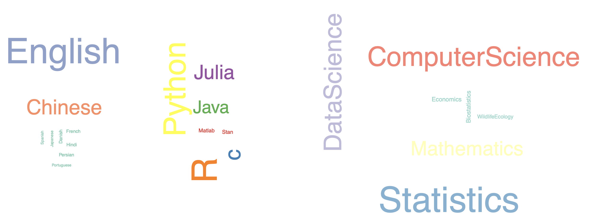
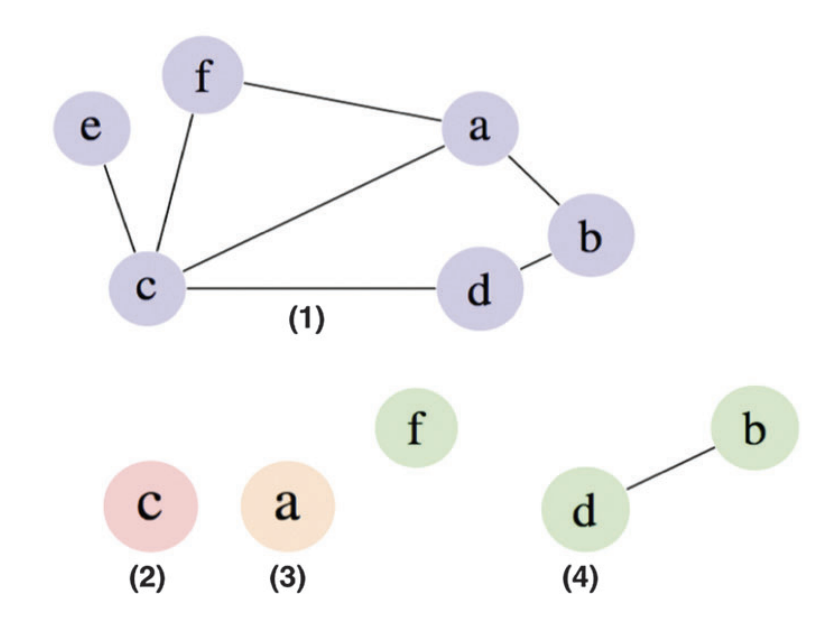
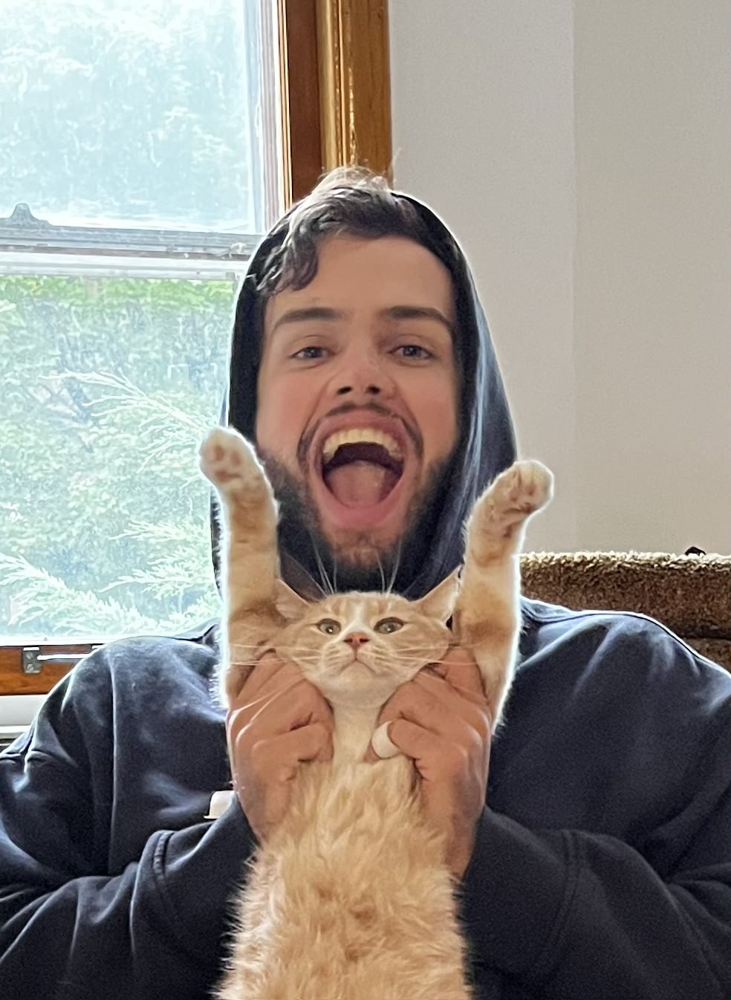
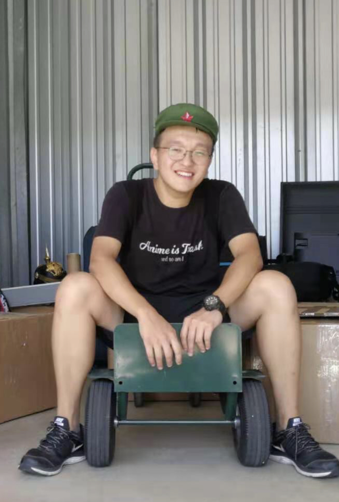
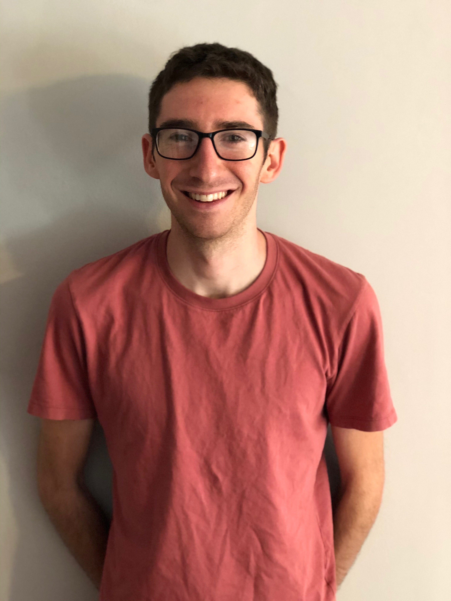
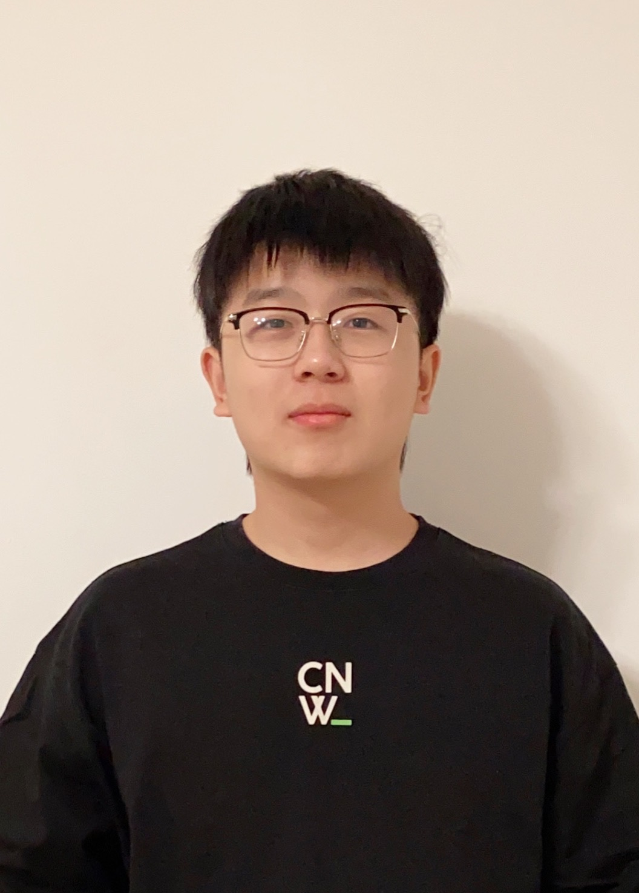

    

        <ul class="nav">
            <li><a href="#postdocs">postdocs</a></li>
            <li><a href="#graduate">graduate</a></li>
            <li><a href="#undergraduate">undergraduate</a></li>
            <li><a href="#past">past</a></li>
            <li><a href="#opportunities">oppportunities</a></li>
        </ul>
    

    

### Claudia Sol&iacute;s-Lemus

I am an assistant professor at the [Wisconsin Institute for Discovery](https://wid.wisc.edu/) and the [Department of Plant Pathology](https://plantpath.wisc.edu/) at the [University of Wisconsin-Madison](http://www.wisc.edu). Originally from Mexico City, I did my Undergraduate degrees
in Actuarial Sciences and Applied Mathematics at [ITAM](https://www.itam.mx/en).
Then, I did a MA in [Mathematics](http://www.math.wisc.edu) and a PhD in [Statistics](http://www.stat.wisc.edu) at the [University of Wisconsin-Madison](http://www.wisc.edu). In my spare time, I enjoy swimming, running, biking, climbing and yoga!

Pronouns: she/her

Name pronunciation: [namedrop.io/claudiasolislemus](https://namedrop.io/claudiasolislemus)

<button type="button" onclick="window.location.href='https://github.com/solislemuslab/solislemuslab.github.io/blob/master/assets/cv.pdf';">cv</button>
<button type="button" onclick="window.location.href='https://scholar.google.com/citations?user=GrUypj8AAAAJ&hl=en&oi=ao';">google scholar</button>
<button type="button" onclick="window.location.href='https://github.com/crsl4';">github</button>
<button type="button" onclick="window.location.href='https://www.athlinks.com/athletes/267606489';">athlinks</button>
<button type="button" onclick="window.location.href='https://crsl4.github.io/';">website</button>

    

        

            Office 3164 <a href="https://wid.wisc.edu/">Wisconsin Institute for Discovery </a> 
            Office 476 <a href="https://plantpath.wisc.edu/">Department of Plant Pathology </a> 
            <a href="https://www.wisc.edu/">University of Wisconsin-Madison</a> 
            Madison, WI 53715 
            Phone: (608) 316-4568 
            USA  

            

            Email: <code>sol</code><b>I</b><code>islemus</code><b>don't</b><code>@</code><b>want</b><code></code><b>spam!
            </b><code>w</code><b>So</b><code>i</code><b>please</b><code>s</code><b>leave
            </b><code>c</code><b>me</b><code>.</code><b>alone</b><code>e</code><b>!</b><code>du</code> 
            Twitter: <code>@</code><b>I</b><code>sol</code><b>don't</b><code>is</code><b>want</b><code></code><b>spam!
            </b><code>le</code><b>So</b><code>m</code><b>please</b><code>u</code><b>leave
            </b><code>s</code><b>me</b><code>l</code><b>alone</b><code>a</code><b>!</b><code>b</code> 
            Mastodon: <a href="https://mstdn.social/@solislemuslab">https://mstdn.social/@solislemuslab</a> 
            Affiliations at UW-Madison: <a href="https://stat.wisc.edu/">Department of Statistics</a>, <a href="https://math.wisc.edu/">Department of Mathematics</a>, <a href="https://biostat.wiscweb.wisc.edu/">Department of Biostatistics and Medical Informatics</a>, <a href="https://evolution.wisc.edu/">JF Crow Institute for the Study of Evolution</a>, <a href="https://qbi.wisc.edu/">Quantitative Biology Initiative</a>, <a href="https://cgsi.wisc.edu/aboutus/">Center for Genomic Science Innovation</a> 
            

        

        

        
        

    

---

### Postdocs and Research Fellows

    

        

            
        

        

            Rosa Aghdam is a researcher in the area of Statistics and Bioinformatics. Her work is focused on the statistical and computational methods for learning microbiome networks. She earned her PhD in Statistics from Shahid Beheshti university in Iran. 
        

    

    

        

            
        

        

            Ben Rush (he/him) is a post-doctoral researcher collaborating with Wisconsin Fast Plants and co-mentored with John Garrett. His research focuses on using artificial intelligence to analyze genomes and images of bacteria, and to analyze medical images. He obatined a PhD in Nutritional Sciences from the University of Wisconsin-Madison and Masters of Public Health from Indiana University-Bloomington. Ben also enjoys science communication, chocolate, comedy, and going on adventures with friends. Email:rush4@wisc.edu
        

    

### Graduate students

    

        

        
        

        

            Marianne Bjørner is a MS student in Computer Sciences. They work on phylogenetic tree reconstruction as applied to large microbial datasets. They completed their undergraduate degree in Microbiology at the University of Washington.
        

    

    

        

        
        

        

			Nathan Kolbow is a Biostatistics Ph.D. student. His research focuses on the statistical and computational methods for estimating phylogenetic trees and networks. His undergraduate education was in Statistics and Computer Sciences at the University of Wisconsin-Madison. [<a href="https://github.com/NathanKolbow">github</a>]
        

    

    

        

        
        

        

       		Xudong Tang is a MS student in Statistics: Data Science. He works on neural network models on soil micobiome data to predict characteristics of potato growth. His completed his undergraduate degree in Computer Sciences and Mathematics at the University of Wisconsin-Madison. 
	 

    

    

        

        
        

        

       		<a href="https://sites.google.com/view/evangorstein">Evan Gorstein</a> is a PhD student in statistics. He works on high dimensional mixed effect models for microbiome data. He completed his undergraduate degree in math and statistics at the University of Chicago.
	 

    

---

### Undergraduate students

    

        

        
        

        

            Zhaoxing Wu is a sophomore undergraduate student in Computer Science, Data Science, and Statistics. She works on the microbial data analysis of dollar spot disturbance.
        

    

    

        

        
        

        

            Yuke Wu is a junior undergraduate student in Computer Science, Mathematics, and Statistics. She works on testing and debugging the BioKlustering web app on a variety of real life datasets.
        

    

    

        

        
        

        

            <a href="https://pages.cs.wisc.edu/~rnelson/">Reed Nelson</a> is a senior studying Computer Science, Mathematics, and Philosophy. He is developing an algorithm to align soil microbiome networks based on topological and biological data.
     

    

    

        

        
        

        

            Yibo Kong is a sophomore undergraduate student majoring in Computer Science and Data Science. He works on unsupervised learning of phylogenetic trees.
     

    

---

### Past members
- [Sam Ozminkowski](https://samozminkowski.com/) (MS Statistics, UW-Madison 2022).  He worked on Bayesian models with network predictors, specifically focusing on microbiome networks. He is pursuing his PhD in Statistics at Northwestern University.
- [Fardeen Meeran](https://meerxn.github.io/MyPersonalCV/) (BS Computer Science, UW-Madison 2022). He worked in a web app to visualize phylogenetic networks.
- [Zhaoyi Zhang](https://www.linkedin.com/in/zhang-zhaoyi/) (BS Computer Science, Data Science, Mathematics, UW-Madison 2022). He tested the applicability of deep neural networks to genomic datasets to predict important phenotypes. He will work as a Software Engineer at Oracle after graduation.
- [Elaine Wu](https://www.linkedin.com/in/qiaowenwu/) (BS Computer Science, UW-Madison 2022) is currently a MS student in Carnegie Mellon.
- [Yunyi Shen](https://yunyishen.github.io/) (MS Statistics, Wildlife Ecology, UW-Madison 2021) worked on graphical selection of Gaussian chain graph models using Bayesian LASSO and Spike-and-Slab LASSO methods, their theories, interpretations and applications in microbiome. He is attending EECS PhD program at MIT affiliated with LIDS. 
- [Nicole Athanasiou](https://github.com/nathanasiou) (BS Applied Mathematics, Statistics, Environmental Studies, UW-Madison 2021) created interactive web application for biologists to determine their sample size in experiments. 
- [Shengwen Yang](https://www.shengwenyang.com/) (MS Data Science, UW-Madison 2021) worked on the symmetry preserving Neural Network models for phylogenetic inference.
- [Yuren Sun](https://yurensun.github.io/) (BS Computer Science, Mathematics, and Economics, UW-Madison 2021) worked on the applications of neural network models in the classifications of animals and pseudomonas sequence data. She will attend MSCS program at Stanford University in Fall 2022.
- [Songyang Cheng](https://csy99.github.io/Blog/) (BBA, Information Systems + Computer Science, UW-Madison 2021). He tested the applicability of neural network models to microbial genomic datasets to predict important phenotypes like those related to antibiotic resistance. He is attending MEng EECS program at UC-Berkeley. 
- Junting Wang (BS Statistics, UW-Madison 2020) is attending UMichigan at the Statistics PhD program
- [Ritika Mittal](https://www.linkedin.com/in/ritika-mittal-011ab2178/) (BS Computer Science, UW-Madison 2022) worked on user-friendly open-source software that would allow biologists to visualize complex phylogenetic networks.
- [Lareina Liu](https://www.linkedin.com/in/lareina-xiaoyu-liu-90553a140/) (BS Statistics, UW-Madison 2020). She is starting ADS Masters Program at USC in Fall 2020
- Yizhou Liu (BS Computer Science + Mathematics, UW-Madison 2021) worked on user-friendly open-source software for WI Fast Plants. He is attending INI program at CMU
- Yifan Wu (BS Computer Engineering, UW-Madison 2020)
- Yuzheng Zhang (BS Computer Sciences, UW-Madison 2021)
- Liule Yang
- Zhiwen Xu
- Chunrong Huang

---

### Opportunities

    

        

        <iframe width="250" height="200"
            src="https://youtube.com/embed/z3nbG6MUJvM">
        </iframe>
        

        

            The Solis-Lemus lab is located in the <a href="https://wid.wisc.edu/">Wisconsin Institute for Discovery</a>, which provides immense opportunities for interdisciplinary connections and networking for students and postdocs!
        

    

- If you are an undergraduate student:
    - currently enrolled at UW-Madison looking for research experience, read [here](https://github.com/solislemuslab/lab-dynamics/blob/master/interest-in-lab.md#undergrad)
    - wanting to apply to grad school at UW-Madison, read [here](https://github.com/solislemuslab/lab-dynamics/blob/master/interest-in-lab.md#apply)
- If you are a graduate student:
    - currently enrolled (or soon to start) at UW-Madison interested in joining the lab or doing a rotation, read [here](https://github.com/solislemuslab/lab-dynamics/blob/master/interest-in-lab.md#grad)
    - wanting to apply to grad school at UW-Madison, read [here](https://github.com/solislemuslab/lab-dynamics/blob/master/interest-in-lab.md#apply)
    - wanting to apply for a postdoc position, read [here](https://github.com/solislemuslab/lab-dynamics/blob/master/interest-in-lab.md#applypostdoc)
- If you are a postdoc:
    - wanting to apply for a postdoc position in the lab, read [here](https://github.com/solislemuslab/lab-dynamics/blob/master/interest-in-lab.md#applypostdoc)
    - wanting to apply to your own funding with me as supervisor, read [here](https://github.com/solislemuslab/lab-dynamics/blob/master/interest-in-lab.md#postdocfunds)

#### New positions funded by NSF CAREER

- [Postdoctoral researcher in the inference of phylogenetic networks](https://solislemuslab.github.io//pages/positions-career1.html)
- [Postdoctoral position in statistical education](https://solislemuslab.github.io//pages/positions-career2.html)
- [Project assistantship in Julia package development and maintenance](https://solislemuslab.github.io//pages/positions-career3.html)
