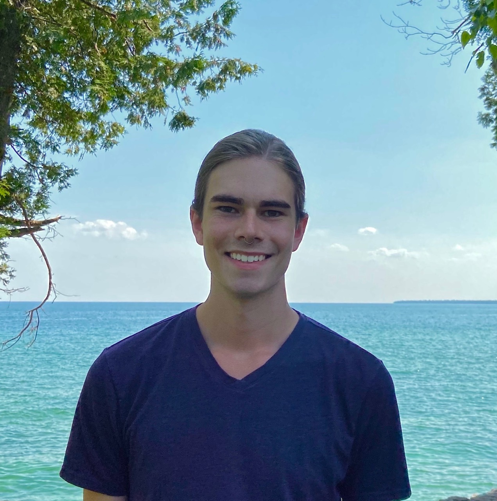

    

        <ul class="nav">
            <li><a href="#postdocs">postdocs</a></li>
            <li><a href="#graduate">graduate</a></li>
            <li><a href="#undergraduate">undergraduate</a></li>
            <li><a href="#past">past</a></li>
            <li><a href="#opportunities">oppportunities</a></li>
        </ul>
    

### Lab composition

    
    
    

---

### Claudia Sol&iacute;s-Lemus

I am an assistant professor at the [Wisconsin Institute for Discovery](https://wid.wisc.edu/) and the [Department of Plant Pathology](https://plantpath.wisc.edu/) at the [University of Wisconsin-Madison](http://www.wisc.edu). Originally from Mexico City, I did my Undergraduate degrees
in Actuarial Sciences and Applied Mathematics at [ITAM](https://www.itam.mx/en).
Then, I did a MA in [Mathematics](http://www.math.wisc.edu) and a PhD in [Statistics](http://www.stat.wisc.edu) at the [University of Wisconsin-Madison](http://www.wisc.edu). In my spare time, I enjoy swimming, running, biking, climbing and yoga!

Pronouns: she/her

Name pronunciation: [namedrop.io/claudiasolislemus](https://namedrop.io/claudiasolislemus)

<button type="button" onclick="window.location.href='https://github.com/crsl4/crsl4.github.io/blob/master/assets/cv.pdf';">cv</button>
<button type="button" onclick="window.location.href='https://scholar.google.com/citations?user=GrUypj8AAAAJ&hl=en&oi=ao';">google scholar</button>
<button type="button" onclick="window.location.href='https://github.com/crsl4';">github</button>
<button type="button" onclick="window.location.href='https://www.athlinks.com/athletes/267606489';">athlinks</button>
<button type="button" onclick="window.location.href='https://crsl4.github.io/';">website</button>

    

        

            Office 3164 <a href="https://wid.wisc.edu/">Wisconsin Institute for Discovery </a> 
            Office 476 <a href="https://plantpath.wisc.edu/">Department of Plant Pathology </a> 
            <a href="https://www.wisc.edu/">University of Wisconsin-Madison</a> 
            Madison, WI 53715 
            Phone: (608) 316-4568 
            USA  

            

            Email: <code>sol</code><b>I</b><code>islemus</code><b>don't</b><code>@</code><b>want</b><code></code><b>spam!
            </b><code>w</code><b>So</b><code>i</code><b>please</b><code>s</code><b>leave
            </b><code>c</code><b>me</b><code>.</code><b>alone</b><code>e</code><b>!</b><code>du</code> 
            Twitter: <code>@</code><b>I</b><code>sol</code><b>don't</b><code>is</code><b>want</b><code></code><b>spam!
            </b><code>le</code><b>So</b><code>m</code><b>please</b><code>u</code><b>leave
            </b><code>s</code><b>me</b><code>l</code><b>alone</b><code>a</code><b>!</b><code>b</code> 
            Affiliations at UW-Madison: <a href="https://stat.wisc.edu/">Department of Statistics</a>, <a href="https://math.wisc.edu/">Department of Mathematics</a>, <a href="https://evolution.wisc.edu/">JF Crow Institute for the Study of Evolution</a>, <a href="https://qbi.wisc.edu/">Quantitative Biology Initiative</a>, <a href="https://cgsi.wisc.edu/aboutus/">Center for Genomic Science Innovation</a> 
            

        

        

        
        

    

---

### Graduate students

    

        

        
        

        

            Yunyi Shen is a MS student in Wildlife Ecology and in Statistics. He works on Bayesian regression models that reconstruct network from observations and their applications in the community ecology of mammals/plants/microbes. He did his undergraduate degree in Physical Biology at <a href="http://english.pku.edu.cn/">Peking University</a>. [<a href="https://yunyishen.ml/">personal website</a>] [<a href="https://github.com/YunyiShen">github</a>] 
        

    

    

        

            
        

        

            Sam Ozminkowski is a MS student in Statistics. His work is focused on using Bayesian models with network predictors, specifically focusing on microbiome networks. He earned his undergraduate degree in Computer Science at the University of Michigan. 
        

    

    

        

        
        

        

            Marianne Bjørner is a MS student in Computer Sciences. They work on phylogenetic tree reconstruction as applied to large microbial datasets. They completed their undergraduate degree in Microbiology at the University of Washington.
        

    

    

        

        
        

        

            Shengwen Yang is a MS student in Statistics: Data Science. His work is focused on using a trained Neural Network model to improve computation speed on maximum likelihood inference for a given tree. He earned his undergraduate degree in Computer Science and Mathematics at the University of Wisconsin, Madison.
        

    

---

### Undergraduate students

    

        

        
        

        

            Zhaoyi Zhang is a junior undergraduate student in Computer Science and in Data Science. He is testing the applicability of neural network models to microbial genomic datasets to predict important phenotypes like those related to antibiotic resistance.
        

    

    

        

        
        

        

            Zhaoxing Wu is a sophomore undergraduate student in Computer Science, Data Science, and Statistics. She works on the microbial data analysis of dollar spot disturbance.
        

    

    

        

        
        

        

            Elaine Wu is a senior undergraduate student in Computer Science and Math. She works on the data analysis and visualization code for the potato seed certification database.
        

    

    

        

        
        

        

            Yuke Wu is a junior undergraduate student in Computer Science, Mathematics, and Statistics. She works on testing and debugging the BioKlustering web app on a variety of real life datasets.
        

    

    

        

        
        

        

            Fardeen Meeran is a senior undergraduate student majoring in Computer Science. He currently is taking part in the development and testing of the Phylogenetic network visualization application. 
            
            <button type="button" onclick="window.location.href='https://meerxn.github.io/MyPersonalCV/';">website</button>
     

    

          

    

        

        
        

        

            Nicole Athanasiou is a senior undergraduate student majoring in Applied Mathematics, Statistics, and Environmental Studies. She is programming simulations and data analyses as an extension of a work involving a gene mapping model of multiple variants with multiple phenotypes. 
     

    

    

        

        
        

        

            Reed Nelson is a junior undergraduate student majoring in Computer Science, Mathematics, and Philosophy. He is building a self-sustaining database of Latinx in Statistics and Data Science for the <a href="https://www.amstat.org/">American Statistical Association</a>. 
     

    

---

### Past members
- [Yuren Sun](https://yurensun.github.io/) (BS Computer Science, Mathematics, and Economics, UW-Madison 2021) worked on the applications of neural network models in the classifications of animals with sounds.
- [Songyang Cheng](https://csy99.github.io/Blog/) (BBA, Information Systems + Computer Science, UW-Madison 2021). He tested the applicability of neural network models to microbial genomic datasets to predict important phenotypes like those related to antibiotic resistance. He is attending MEng EECS program at UC-Berkeley. 
- Junting Wang (BS Statistics, UW-Madison 2020) is attending UMichigan at the Statistics PhD program
- [Ritika Mittal](https://www.linkedin.com/in/ritika-mittal-011ab2178/) (BS Computer Science, UW-Madison 2022) worked on user-friendly open-source software that would allow biologists to visualize complex phylogenetic networks.
- [Lareina Liu](https://www.linkedin.com/in/lareina-xiaoyu-liu-90553a140/) (BS Statistics, UW-Madison 2020). She is starting ADS Masters Program at USC in Fall 2020
- Yizhou Liu (BS Computer Science + Mathematics, UW-Madison 2021) worked on user-friendly open-source software for WI Fast Plants. He is attending INI program at CMU
- Yifan Wu (BS Computer Engineering, UW-Madison 2020)
- Yuzheng Zhang (BS Computer Sciences, UW-Madison 2021)
- Liule Yang
- Zhiwen Xu
- Chunrong Huang

---

### Opportunities

    

        

        <iframe width="250" height="200"
            src="https://youtube.com/embed/z3nbG6MUJvM">
        </iframe>
        

        

            The Solis-Lemus lab is located in the <a href="https://wid.wisc.edu/">Wisconsin Institute for Discovery</a>, which provides immense opportunities for interdisciplinary connections and networking for students and postdocs!
        

    

- If you are an undergraduate student:
    - currently enrolled at UW-Madison looking for research experience, read [here](https://github.com/solislemuslab/lab-dynamics/blob/master/interest-in-lab.md#undergrad)
    - wanting to apply to grad school at UW-Madison, read [here](https://github.com/solislemuslab/lab-dynamics/blob/master/interest-in-lab.md#apply)
- If you are a graduate student:
    - currently enrolled (or soon to start) at UW-Madison interested in joining the lab or doing a rotation, read [here](https://github.com/solislemuslab/lab-dynamics/blob/master/interest-in-lab.md#grad)
    - wanting to apply to grad school at UW-Madison, read [here](https://github.com/solislemuslab/lab-dynamics/blob/master/interest-in-lab.md#apply)
    - wanting to apply for a postdoc position, read [here](https://github.com/solislemuslab/lab-dynamics/blob/master/interest-in-lab.md#applypostdoc)
- If you are a postdoc:
    - wanting to apply for a postdoc position in the lab, read [here](https://github.com/solislemuslab/lab-dynamics/blob/master/interest-in-lab.md#applypostdoc)
    - wanting to apply to your own funding with me as supervisor, read [here](https://github.com/solislemuslab/lab-dynamics/blob/master/interest-in-lab.md#postdocfunds)

