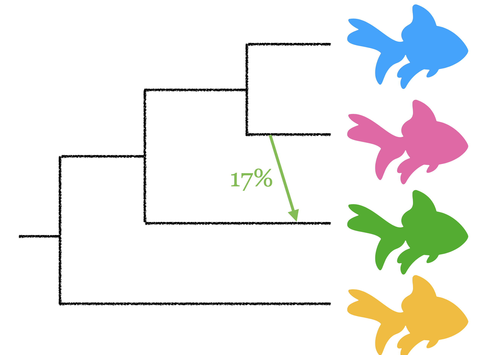

# Postdoctoral research position in phylogenetic networks

### Overview 

    

        

        
        

        

            <b>What:</b> Postdoctoral position in the inference of phylogenetic networks. Full-time, two years of funding with potential for extension based on performance/funding.  
            <b>Where:</b> <a href="https://wid.wisc.edu">Wisconsin Institute for Discovery</a> at the University of Wisconsin-Madison at <a href="https://solislemuslab.github.io/">Solis-Lemus lab</a>.  
            <b>When:</b> ASAP (negotiable).  
            <b>Minimum qualifications:</b> Strong quantitative background and programming skills. Candidates must hold a PhD at the time of the appointment.  
        

    

### More details

#### The project

Existing tree reconstruction methods are limited because they cannot account for important biological processes like hybridization, introgression or horizontal gene transfer, and thus, recent years have seen an explosion of methods to reconstruct phylogenetic networks.
Existing network reconstruction methods, however, lack statistical guarantees of identifiability to ensure the method can detect the reticulate signal in the data, are usually not scalable enough for big data and are only tailored to reconstruct simple networks.

This project will contribute to the fundamental research of the Network of Life by producing novel statistical theory on the inference of complex phylogenetic networks and open-source easy-to-use publicly available software with broad applicability within evolutionary biology and systematics. [PhyloNetworks](https://github.com/crsl4/PhyloNetworks.jl) is the third most widely used Julia package in genomics, but its network inference method ([SNaQ](https://journals.plos.org/plosgenetics/article?id=10.1371/journal.pgen.1005896)) is restricted to level-1 phylogenetic networks. As part of this project, we will extend the pseudolikelihood model within SNaQ to more complex networks and we will explore other divide-and-conquer strategies that would allow us to push the scalability limits on phylogenetic network inference.

#### The lab

The Solis-Lemus lab is located in the Wisconsin Institute for Discovery in the University of Wisconsin-Madison. You can learn more about the lab composition, work and environment by checking out the lab website: https://solislemuslab.github.io/

#### Job duties
The primary duties of the postdoctoral researcher include but are not limited to:
- Develop novel statistical theory on identifiability and inference of complex classes of phylogenetic networks;
- Implement the novel theory in open source software;
- Design simulation studies to test the performance of the novel methods;
- Write up research findings for presentations at scientific and lay meetings;
- Write up research findings for publication in peer-reviewed journals.

The secondary duties include but are not limited to assisting with general lab activities, attending lab meetings, interacting with lab investigators/staff, and helping mentor graduate and undergraduate students in the lab.

#### Other relevant skills
- Knowledge of version control via git/github 
- Interest in scientific communication (oral/written)
- Interest in working independently as leader of the research project, but also as part of a collaborative team
- Experience on julia programming is desirable, but not mandatory to apply

### How to apply

Send an email to solislemus AT wisc.edu with the following materials:
- CV
- short research statement describing past experience in phylogenetics (<1 page)
- two representative publications 
- contact info of two recommenders
- code sample (e.g. on github) showing work that you are proud of

**Deadline:** Candidates will be considered until position is filled.
