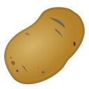
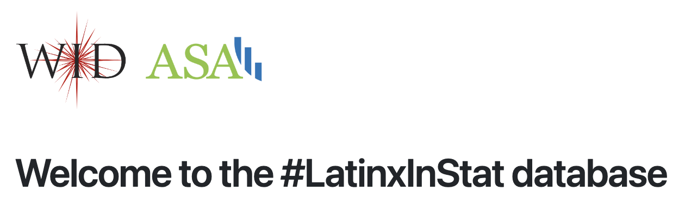

    

        <ul class="nav">
            <li><a href="https://github.com/crsl4">github-crsl4</a></li>
            <li><a href="https://github.com/solislemuslab">github-solislemuslab</a></li>
        </ul>
    

---

    

        

            <a href="https://github.com/crsl4/PhyloNetworks.jl">PhyloNetworks</a> 
            A <a href="http://julialang.org/">Julia</a> package for statistical inference, data manipulation and visualization of phylogenetic networks  

            To receive announcements about updates to PhyloNetworks, join the 
            <a href="https://groups.google.com/forum/#!forum/phylonetworks-users">PhyloNetworks google group</a> 
        

        

        
        

    

---

    

        

            <a href="https://github.com/crsl4/PhyloNetworks.jl">SNaQ</a> 
            Maximum pseudolikelihood estimation of species network. The procedure involves a numerical optimization of branch lengths and inheritance probabilities and a heuristic search in the space of phylogenetic networks.  

            SNaQ is one function within the <a href="https://github.com/crsl4/PhyloNetworks.jl">PhyloNetworks</a> Julia package.
        

        

        
        

    

---

<a href="https://github.com/cecileane/iBPP/">iBPP</a> 
Bayesian species delimitation integrating genes and traits data.

---

    

        

            <a href="https://wi-fast-stats.wid.wisc.edu/">WI Fast Stats</a> 
            Integrated web page with access to all available web apps for data visualization of <a href="https://fastplants.org/">WI Fast Plants</a> <a href="https://youtu.be/6vX3mVXcK4s">YouTube short tutorial</a>  
        

        

        
        

    

---

    

        

            <a href="https://github.com/YunyiShen/CAR-LASSO">CARlasso</a> 
            An R package for fitting Conditional Auto-Regressive LASSO, a class of models that infers (sparse) Gaussian chain graph with predictor and response nodes as well as its extensions  

            Also please see the  
            <a href="https://yunyishen.ml/CAR-LASSO/dev/">documentations and tutorials.</a> 
        

        

        
        

    

---

    

        

            <a href="https://potato-seed-dashboard.wid.wisc.edu/">Potato Dashboard</a> 
            Proprietary data visualization and data analysis dashboard for the <a href="https://seedpotato.russell.wisc.edu/">WI Seed Potato Cert program</a> <a href="https://github.com/solislemuslab/potato-seed-cert">GitHub repository</a>  
        

        

        
        

    

---

    

        

            <a href="https://github.com/solislemuslab/BayesianNetworkRegression.jl">BayesianNetworkRegression.jl</a> 
            A Julia package for fitting Bayesian Network Regression, a model for inferring the relationships between microbiome networks and a dependent variable of interest like biological phenotypes.
            Also please see the  
            <a href="https://solislemuslab.github.io/BayesianNetworkRegression.jl/dev/">documentation and tutorials.</a> 
        

        

        
        

    

---

    

        

            <a href="https://bioklustering.wid.wisc.edu/">BioKlustering</a> 
            BioKlustering is a web app for learning and visualization of genomic data. You can choose from a variety of supervised, unsupervised and semi-supervised machine-learning methods to cluster genomic sequences.
            Also please see the  
            <a href="https://github.com/solislemuslab/bioklustering">github repo.</a> 
        

        

        
        

    

---

    

        

            <a href="https://latinxinstat.wid.wisc.edu/">LatinxInStat database</a> 
            The LatinxInStat database contains information of Latinx statisticians and data scientists. If you identify as Latinx, please add yourself to the database by logging in with Google and creating your profile. If you are organizing a statistical conference, please use this database to include a more diverse representation of speakers.
        

        

        
        

    

---

