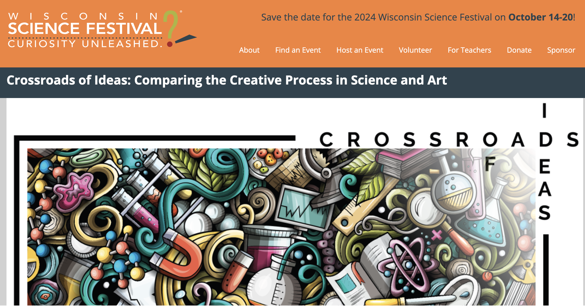
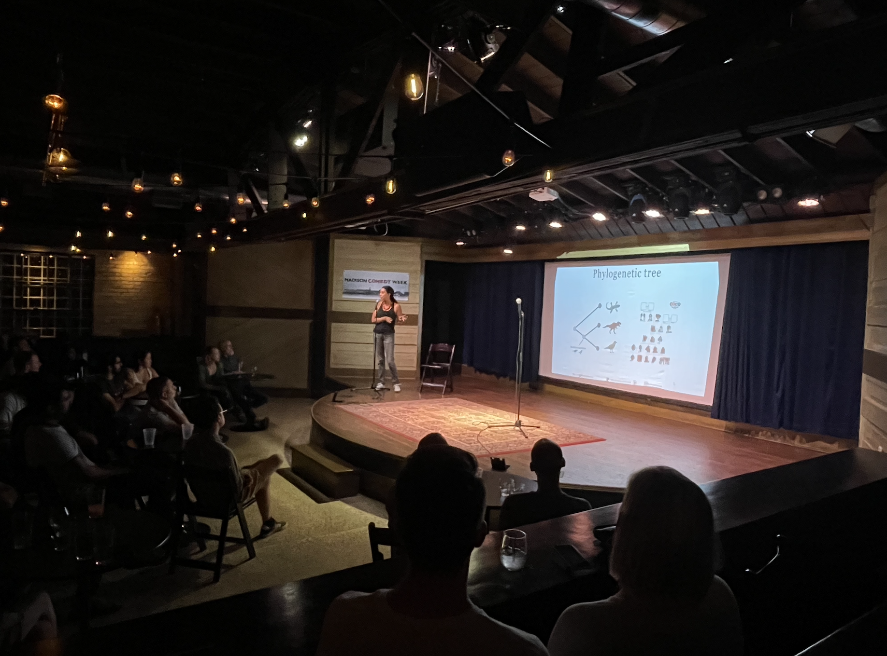
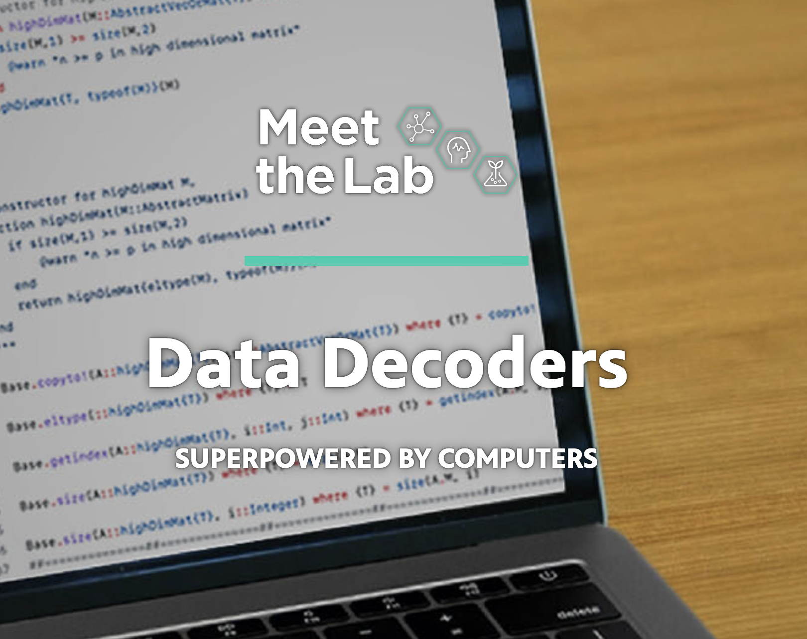
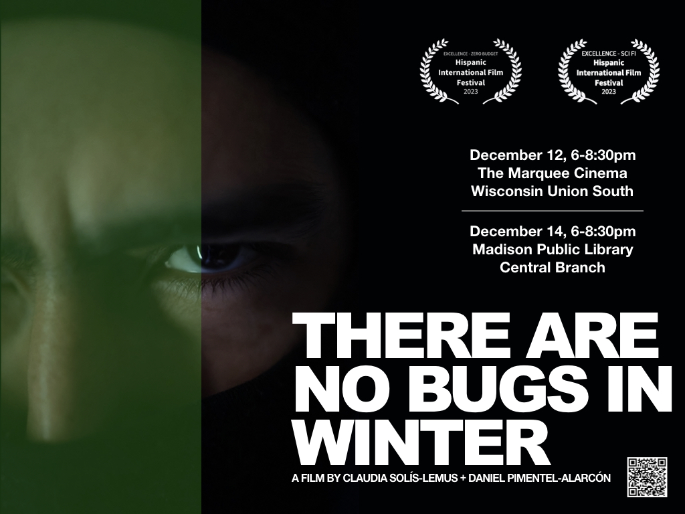
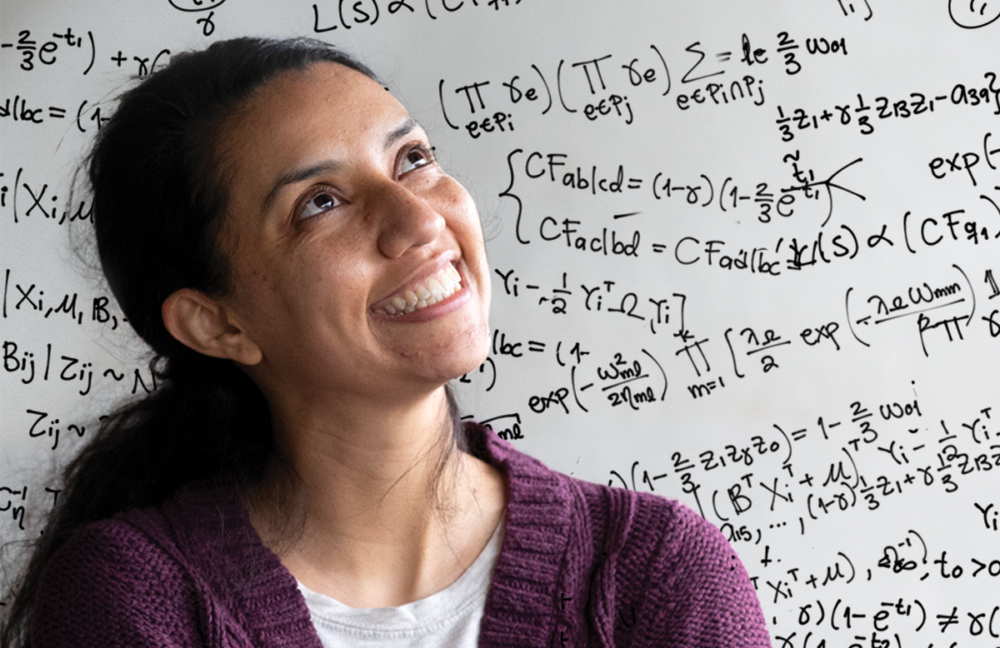

    

        <ul class="nav">
            <li><a href="#talks">talks</a></li>
            <li><a href="#outreach">outreach</a></li>
            <li><a href="#media">media</a></li>
            <li><a href="https://solislemuslab.github.io/el-zoominario">el-zoominario</a></li>
            <li><a href="https://www.youtube.com/channel/UCcBcmxIYYGC6Z04p9SC7hwg/featured">youtube-channel</a></li>
        </ul>
    

## Solis-Lemus selected talks

### 2023

[Algebraic Statistics for Ecological and Biological Systems](https://www.imsi.institute/activities/algebraic-statistics-for-ecological-and-biological-systems/) at the Institute for Mathematical and Statistical Innovation (IMSI) on the campus of the University of Chicago on "Ultrafast learning of 4-node hybridization cycles using phylogenetic invariants" (_Oct 11_).

BMI Seminar (UW-Madison). "Inferring networks" (_Oct 6_)

Botany conference. "Phylogenetic networks to study reticulate evolution" (_Jul 25_).

Toronto Workshop on Reproducibility. "Accessible reproducibility for biological researchers" (_Feb 23_). [website](https://crsl4.github.io/mindful-programming/)

WID seminar. "Biological Networks from Adaptable Mathematics" (_Feb 1_)

### 2022

PBEE seminar at Emory University. "From phylogenetic networks to microbial networks: novel tools for networked data" (_Nov 18_)

Evolution conference: "Statistical challenges to infer phylogenetic networks" in the symposium of "Towards the Network of Life" (_June 28_)

Evolution conference. Invited panelist for the iEvoBio panel "Build it right from the start". (_June 24_)

EEOB Seminar series in Iowa State U: Statistical challenges to infer phylogenetic networks (_May 5_)

Scalable inference of phylogenetic networks, [RADsequencing for phylogenOMICs](https://www.taxon-omics.com/news-events-bl/5-6-april-2022-rad-sequencing-for-phylogenomics), Taxon-OMICS partners from Göttingen, München and Braunschweig (_Apr 6_)

### 2021

[Coloquio de la Sociedad Matemática Mexicana](https://www.smm.org.mx/coloquioconjunto/410/biologia-evolutiva-a-traves-de-los-ojos-de-ciencias-de-datos): Biologia evolutiva a traves de los ojos de Ciencias de Datos (_Nov 25_) [YouTube](https://www.youtube.com/watch?v=uADQQbS2oa4)

[ISCB EvolCompGen: Evolution & Comparative Genomics](https://www.iscb.org/cms_addon/conferences/ismbeccb2021/tracks/evolcompgen): Scalable inference of phylogenetic networks (_Nov 2_) [YouTube](https://www.youtube.com/watch?v=J9HjsJ9PaGI)

[I Congreso Latinoamericano de Evolucion](https://www.socevol.cl/?p=1621&lang=en): Metodos estadisticos para reconstruir redes filogeneticas (_Nov 30_)

Invited speaker by graduate students to Organisms and Evolution seminar talk at Duke University: Statistical challenges on phylogenetic networks (_Nov 11_)

[American Math Society Special Session on Phylogenetic Networks](https://meetings.ams.org/math/fall2021w/meetingapp.cgi/Session/3956): Identifiability of phylogenetic networks (_Oct 24_)

[WI Science Festival Delta Beer Lab](https://www.wisconsinsciencefest.org/event/the-adventure-of-the-statisticians-rule-of-thumb/): The adventures of the statistician's rule of thumg (_Oct 21_)

Biology seminar series (U. Florida) -- From phylogenetic networks to microbial networks: statistical tools for networked data (_Oct 12_)

Kenneth B. Raper Symposium (UW-Madison) -- Novel methods to reconstruct microbial networks with environmental or experimental predictors (_Sept 3_)

Think STEM! -- Learning the Tree of Life with Data Science (_Aug 2_) 

ClubEcoEvo Latinoamerica -- Metodos estadisticos para estudiar comunidades microbianas (_July 23_) [YouTube](https://www.youtube.com/watch?v=PKXf1W4bocQ)

[Evolution 2021](https://www.evolutionmeetings.org/) -- Behind the scenes of phylogenetic reconstruction with SNaQ (_June 21-25_)

[BISP12](https://bisp12.imati.cnr.it/home_page.php) -- Bayesian CAR-LASSO model to learn sparse networks with predictors (_May 28_)

INFORMS en espanol -- Biologica evolutiva a traves de los ojos de ciencias de datos (_Mar 18_) [YouTube](https://www.youtube.com/watch?v=xfbU6pvSUwI)

[Algorithms and Complexity in Phylogenetics seminar](https://simonelinz.wordpress.com/online-seminar/), Scalable inference of phylogenetic networks (_Mar 11_) [YouTube](https://www.youtube.com/watch?v=wxG7avXjgTs)

Department of Statistics – Ohio State University, Scalable inference of phylogenetic networks (_Feb 25_)

Code conversations with [Casey Dunn](http://dunnlab.org/) (_Feb 8_) [YouTube](https://www.youtube.com/watch?v=Byhc0tksgSk)

CIBM – UW-Madison, New challenges in phylogenetic inference (_Jan 26_)

Bioinformatics Institute – University of North Carolina, Scalable inference of phylogenetic networks (_Jan 22_)

Department of Ecology and Evolutionary Biology – Ohio State University, Scalable inference of phylogenetic networks (_Jan 21_)

Wednesday at the Lab – University of Wisconsin-Madison, Through the looking glass of Data Science (_Jan 20_) [YouTube](https://www.youtube.com/watch?v=CdzIGGumW5k) (talk starts around minute 19); [Ishtmus article](https://isthmus.com/events/wntl-jan-20/)

El Zoominario: Learning the Tree of Life (_Jan 8_) [YouTube](https://www.youtube.com/watch?v=lAP8kpPa288&list=PL1AfUDnwvYbOA9rfrvyA2nR9SR0VYbklx&index=4&t=4s)

### 2020

Department of Statistics -- University of British Columbia:
Scalable inference of phylogenetic networks (_Nov 10_)

Biology seminar -- University of Central Florida: Comparative methods on phylogenetic networks (_Nov 9_)

The Biology Department -- George Washington University: Scalable inference of phylogenetic networks (_Oct 30_ )

BadgerTalk -- Cedarburg Public Library: Through the looking glass of Data Science (_Oct 15_)

Department of Biological Sciences, Auburn University: Scalable inference of phylogenetic networks (_Sept 24_)

WID Symposium: Statistical methods for biological applications (_Aug 27_)

[Virtual talk](https://amstat-jsm.conferencecontent.net/paper/313478) at the [Joint Statistical Meetings (JSM)](https://ww2.amstat.org/meetings/jsm/2020/onlineprogram/index.cfm) on the Section of Statistical Methods in Phylogenetics and Metagenomics (_Aug 4_)

Methods in phylogenetic inference - [SBE Meeting](https://sbemeeting.weebly.com/schedule.html): What are phylogenetic networks and why should we care? (_Jul 28_). [YouTube](https://www.youtube.com/watch?v=4ByqoDnpVew)

Microbiome Hub Seminar - WID: Scalable Inference of Phylogenetic Networks (_May 7_)

Statistics seminar – UW-Madison: New challenges in phylogenetic inference (_Mar 4_)

Illuminating connections – WID: Identifying Genetic Factors Driving Microbial Phenotypes Through
the Power of Data Science (_Feb 12_)

### 2019

Nantucket [developR](https://github.com/NantucketDevelopeR/2019Workshop) - Nantucket, MA: From mindful programming to reproducible research  
(_Nov 6_)

Bio-mathematics seminar - Georgia Tech: Phylogenetic inference for big data.

(_Oct 31_)

HAMLET seminar - UW-Madison: Using neural networks to predict antibiotic resistance from genomic data.

(_Oct 25_)

Taming the BEAST - Squamish, BC: Bayesian phylogenetic inference for big data.

(_Aug 16_)

Taming the BEAST - Squamish, BC: Statistical models on phylogenetic networks.

(_Aug 14_)

Molecular Evolution Workshop - Woods Hole, MA: Statistical models on phylogenetic networks

(_Aug 6_)

Women in STEM conference - Georgia State University: Through the looking glass of Data Science

(_Apr 5_)

### 2018

Statistics Seminar - Creighton University:  Statistical methods to identify genes associated with disease

(_Oct 26_)

SACNAS - Data Science: The rise of the machines:  Identifying genes associated with disease

(_Oct 12_)

SACNAS - Postdoctoral talks: Machine-learning the tree of life

(_Oct 13_)

JSM - Advanced statistical inference for stochastic models of evolutionary biology:  Comparative methods in phylogenetic networks

(_Aug 1_)

20th IMS New Researchers Conference:  Statistical inference of the Tree of Life

(_Jul 27_)

BUGS seminar - Georgia Institute of Technology:  Statistical methods to reconstruct phylogenetic networks

(_Jan 25_)

###  2017

Microbiome group - Emory University:  Statistical methods to reconstruct phylogenetic networks

(_Nov 29_)

[Mathematical Approaches to Evolutionary Trees and Networks](https://www.birs.ca/events/2017/5-day-workshops/17w5104):  Likelihood challenges for big trees and networks, Banff International Research Station, Canada
(_Feb 13_)

###  2016

[Statistics Seminar](http://www.stat.wisc.edu/):  Phylogenetic inference for Big Data 

(_Dec 14_)

Instituto de Biolog&iacute;a - UNAM: Quartet-based inference of phylogenetic networks, Mexico City, Mexico (_Nov 24_)

[Simposio de Inferencia y Modelaci&oacute;n
Estad&iacute;stica](http://sime.eventos.cimat.mx/): Bayesian
phylogenetic inference for big data, Guanajuato, Mexico

(_Nov 21_)

Advances in the analysis of reticulate population networks: Quartet-based inference of phylogenetic networks

[Evolution](http://www.evolutionmeetings.org/evolution-2016---austin-texas.html), Austin, Texas
(_Jun 20_)

[Phylogenomics symposium and software school](http://tandy.cs.illinois.edu/symposium-2016.html): Quartet-based estimation of reticulate evolution

[Evolution](http://www.evolutionmeetings.org/evolution-2016---austin-texas.html), Austin, Texas
(_Jun 16_)

###  2015

[System Information Learning Optimization Seminar](http://silo.ece.wisc.edu/web/pages/home): Statistical inference of phylogenetic networks

(_Oct 28_)

[Evolution Seminar Series](http://www.evolution.wisc.edu/node/30): Statistical inference of phylogenetic networks

(_Oct 15_)

Bayesian Models and Inference: Bayesian species delimitation combining multiple genes and traits in a unified framework.

[Joint Statistical Meetings](https://www.amstat.org/meetings/jsm/2015/), Seattle, Washington
(_Aug 11_)

Inferring phylogenetic networks from quartets with maximum pseudolikelihood estimation

[Mathematical and Computational Evolutionary Biology](http://www.lirmm.fr/MCEB2015/), Porquerolles, France
(_Jun 22_)

[The Hacker Within](http://www.thehackerwithin.org/wisconsin/) Short introduction on Julia

(_Apr 24_)

[Advance Computing Initiative](http://aci.wisc.edu/): Small tutorial on HTCondor

(_Mar 23_)

[Networks seminar](http://www.math.wisc.edu/wiki/index.php/Networks_Seminar): Statistical inference on phylogenetic networks

(_Mar 11_)

###  2014

Seminario aleatorio: El papel de la Estad&iacute;stica en la inferencia del &aacute;rbol de la vida

[ITAM](https://www.itam.mx/en), Mexico City, Mexico
(_Oct 17_)

------

## Selected outreach events

### 2023
- [Crossroads of Ideas: Comparing the Creative Process in Science and Art](https://www.wisconsinsciencefest.org/event/crossroads-of-ideas-comparing-the-creative-process-in-science-and-art-presented-by-the-wisconsin-book-festival-and-the-wisconsin-science-festival/), part of the WI Science Festival and the WI Book Festival in 2023

- [Celebrating Latinx voices in STEM symposium](https://solislemuslab.github.io/latinx-uwmadison/)

- [Uncontrolled Variables](https://www.uncontrolledvariables.com/about), comedy+science show at The Bur Oak organized by Diya Basrai

- ["Technical to Beautiful: Data as Art" exhibition!](https://www.instagram.com/reel/CtRfUQ4LT_z/?utm_source=ig_web_copy_link&igshid=MzRlODBiNWFlZA==)

- Collaboration Matching experiment at the WID Research Bazaar 2023:

### 2021

- [PBS Meet the Lab: The Data Decoders](https://pbswisconsineducation.org/lab/data-decoders/)

------

## Selected media events

### 2024

-  [Faculty Spotlight](https://www.gwisbeta.org/) in the Chapter of Graduate Women in Science (GWIS-Beta Chapter).

<blockquote class="twitter-tweet">
We are so excited to feature our faculty spotlight Dr. Claudia Solis Lemus <a href="https://twitter.com/solislemuslab?ref_src=twsrc%5Etfw">@solislemuslab</a> ! Her research expertise involves statistical phylogenetics, genomics, and microbiology. Full interview: <a href="https://t.co/zq4Y1gCAwb">https://t.co/zq4Y1gCAwb</a>  Previous highlights (drop down): <a href="https://t.co/nZDl4rXWBK">https://t.co/nZDl4rXWBK</a> <a href="https://t.co/qp9rbjSj3R">pic.twitter.com/qp9rbjSj3R</a>
&mdash; GWIS Madison Chapter (@GWIS_UWMadison) <a href="https://twitter.com/GWIS_UWMadison/status/1752700474988650844?ref_src=twsrc%5Etfw">January 31, 2024</a></blockquote> 

### 2023

- Zero-budget sci-fi movie: [There are no bugs in winter](https://alfalfita-productions.github.io/there-are-no-bugs-in-winter/).

- [Faces of Data Science](https://datascience.wisc.edu/#faces)

<blockquote class="twitter-tweet">
Claudia Solís-Lemus collaborates with life sciences researchers, developing mathematical models to help them understand relationships and interactions among species. Read her story in Faces of Data Science. <a href="https://twitter.com/solislemuslab?ref_src=twsrc%5Etfw">@solislemuslab</a> <a href="https://twitter.com/UWMadisonCALS?ref_src=twsrc%5Etfw">@uwmadisoncals</a> <a href="https://twitter.com/WIDiscovery?ref_src=twsrc%5Etfw">@widiscovery</a> <a href="https://t.co/B6shjQY6X3">https://t.co/B6shjQY6X3</a> <a href="https://t.co/iIaVlb8YbU">pic.twitter.com/iIaVlb8YbU</a>
&mdash; datascience@uw (@datascience_uw) <a href="https://twitter.com/datascience_uw/status/1664278126673948679?ref_src=twsrc%5Etfw">June 1, 2023</a></blockquote> 

- [El Zoominario: giving a voice to Latinx scientists and inspiring the next generation](https://cgsi.wisc.edu/2023/01/23/el-zoominario/), article by Leo Barolo.

### 2021

- Feature on [@mujeres.haciendo.ciencia](https://www.instagram.com/mujeres.haciendo.ciencia/):

<blockquote class="instagram-media" data-instgrm-captioned data-instgrm-permalink="https://www.instagram.com/p/CXhCBNyNFug/?utm_source=ig_embed&amp;utm_campaign=loading" data-instgrm-version="14" style=" background:#FFF; border:0; border-radius:3px; box-shadow:0 0 1px 0 rgba(0,0,0,0.5),0 1px 10px 0 rgba(0,0,0,0.15); margin: 1px; max-width:540px; min-width:326px; padding:0; width:99.375%; width:-webkit-calc(100% - 2px); width:calc(100% - 2px);">
 <a href="https://www.instagram.com/p/CXhCBNyNFug/?utm_source=ig_embed&amp;utm_campaign=loading" style=" background:#FFFFFF; line-height:0; padding:0 0; text-align:center; text-decoration:none; width:100%;" target="_blank"> 
 

 
 

 

 
<svg width="50px" height="50px" viewBox="0 0 60 60" version="1.1" xmlns="https://www.w3.org/2000/svg" xmlns:xlink="https://www.w3.org/1999/xlink"><g stroke="none" stroke-width="1" fill="none" fill-rule="evenodd"><g transform="translate(-511.000000, -20.000000)" fill="#000000"><g><path d="M556.869,30.41 C554.814,30.41 553.148,32.076 553.148,34.131 C553.148,36.186 554.814,37.852 556.869,37.852 C558.924,37.852 560.59,36.186 560.59,34.131 C560.59,32.076 558.924,30.41 556.869,30.41 M541,60.657 C535.114,60.657 530.342,55.887 530.342,50 C530.342,44.114 535.114,39.342 541,39.342 C546.887,39.342 551.658,44.114 551.658,50 C551.658,55.887 546.887,60.657 541,60.657 M541,33.886 C532.1,33.886 524.886,41.1 524.886,50 C524.886,58.899 532.1,66.113 541,66.113 C549.9,66.113 557.115,58.899 557.115,50 C557.115,41.1 549.9,33.886 541,33.886 M565.378,62.101 C565.244,65.022 564.756,66.606 564.346,67.663 C563.803,69.06 563.154,70.057 562.106,71.106 C561.058,72.155 560.06,72.803 558.662,73.347 C557.607,73.757 556.021,74.244 553.102,74.378 C549.944,74.521 548.997,74.552 541,74.552 C533.003,74.552 532.056,74.521 528.898,74.378 C525.979,74.244 524.393,73.757 523.338,73.347 C521.94,72.803 520.942,72.155 519.894,71.106 C518.846,70.057 518.197,69.06 517.654,67.663 C517.244,66.606 516.755,65.022 516.623,62.101 C516.479,58.943 516.448,57.996 516.448,50 C516.448,42.003 516.479,41.056 516.623,37.899 C516.755,34.978 517.244,33.391 517.654,32.338 C518.197,30.938 518.846,29.942 519.894,28.894 C520.942,27.846 521.94,27.196 523.338,26.654 C524.393,26.244 525.979,25.756 528.898,25.623 C532.057,25.479 533.004,25.448 541,25.448 C548.997,25.448 549.943,25.479 553.102,25.623 C556.021,25.756 557.607,26.244 558.662,26.654 C560.06,27.196 561.058,27.846 562.106,28.894 C563.154,29.942 563.803,30.938 564.346,32.338 C564.756,33.391 565.244,34.978 565.378,37.899 C565.522,41.056 565.552,42.003 565.552,50 C565.552,57.996 565.522,58.943 565.378,62.101 M570.82,37.631 C570.674,34.438 570.167,32.258 569.425,30.349 C568.659,28.377 567.633,26.702 565.965,25.035 C564.297,23.368 562.623,22.342 560.652,21.575 C558.743,20.834 556.562,20.326 553.369,20.18 C550.169,20.033 549.148,20 541,20 C532.853,20 531.831,20.033 528.631,20.18 C525.438,20.326 523.257,20.834 521.349,21.575 C519.376,22.342 517.703,23.368 516.035,25.035 C514.368,26.702 513.342,28.377 512.574,30.349 C511.834,32.258 511.326,34.438 511.181,37.631 C511.035,40.831 511,41.851 511,50 C511,58.147 511.035,59.17 511.181,62.369 C511.326,65.562 511.834,67.743 512.574,69.651 C513.342,71.625 514.368,73.296 516.035,74.965 C517.703,76.634 519.376,77.658 521.349,78.425 C523.257,79.167 525.438,79.673 528.631,79.82 C531.831,79.965 532.853,80.001 541,80.001 C549.148,80.001 550.169,79.965 553.369,79.82 C556.562,79.673 558.743,79.167 560.652,78.425 C562.623,77.658 564.297,76.634 565.965,74.965 C567.633,73.296 568.659,71.625 569.425,69.651 C570.167,67.743 570.674,65.562 570.82,62.369 C570.966,59.17 571,58.147 571,50 C571,41.851 570.966,40.831 570.82,37.631"></path></g></g></g></svg>

 
View this post on Instagram

 

 

 

 

 

 

 

 

 

 
 

 

</a>
<a href="https://www.instagram.com/p/CXhCBNyNFug/?utm_source=ig_embed&amp;utm_campaign=loading" style=" color:#c9c8cd; font-family:Arial,sans-serif; font-size:14px; font-style:normal; font-weight:normal; line-height:17px; text-decoration:none;" target="_blank">A post shared by Mulheres Fazendo Ciência (@mujeres.haciendo.ciencia)</a>

</blockquote> 

- [The Tree of Life is Rooted in Math](https://grow.cals.wisc.edu/departments/living-science/the-tree-of-life-is-rooted-in-math), article by Caroline Schneider for GROW magazine:

- WID #WomenHistoryMonth 1-minute chat: 

<iframe width="550" height="400"
    src="https://youtube.com/embed/agnLh41aEfg">
</iframe>

### 2020

- [The flip of a coin](https://www.uwalumni.com/news/the-flip-of-a-coin/), article by Mackenzie Krumme for the Wisconsin Alumni Association website