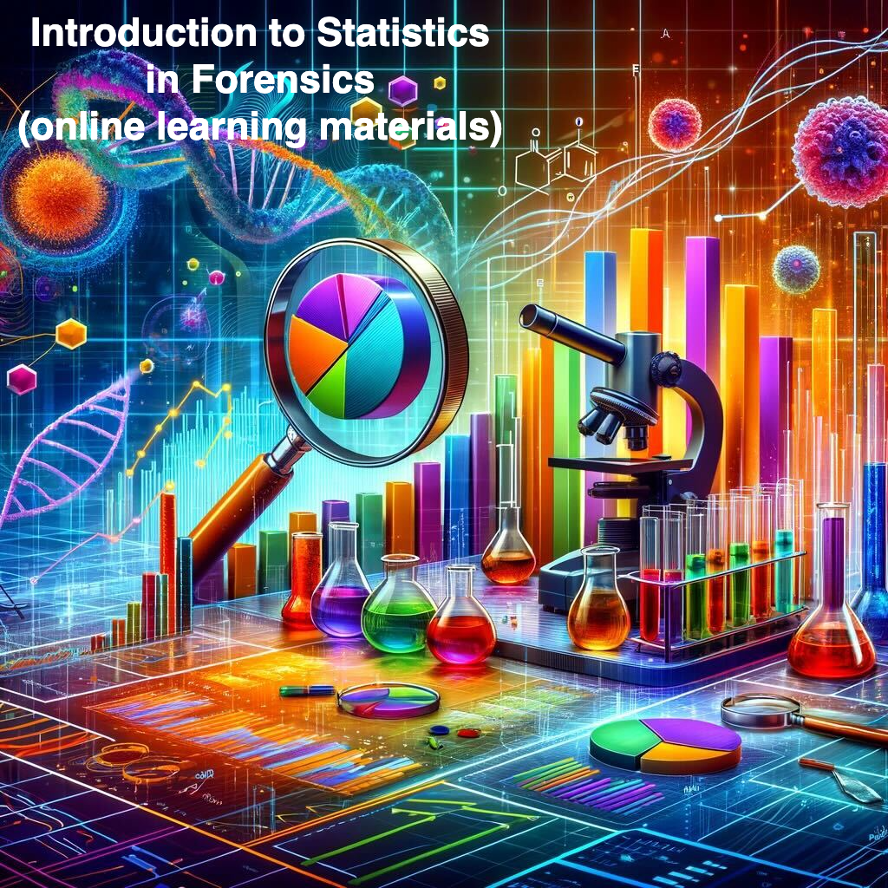
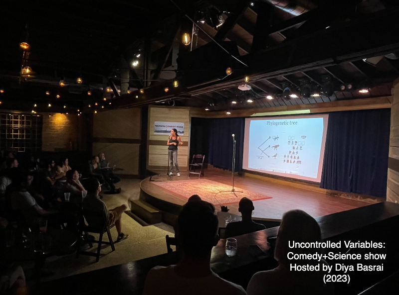
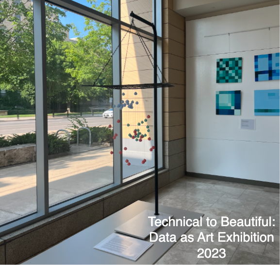

    

        <ul class="nav">
            <li><a href="#latinx">latinx in stem</a></li>
            <li><a href="#stat">stat in the world</a></li>
            <li><a href="#sa">science+art</a></li>
            <li><a href="#media">media</a></li>
            <li><a href="https://www.youtube.com/channel/UCcBcmxIYYGC6Z04p9SC7hwg/featured">youtube-channel</a></li>
        </ul>
    

## Latinx in STEM

## Data Science empowers Science and Society

## Connections between Science and Art

