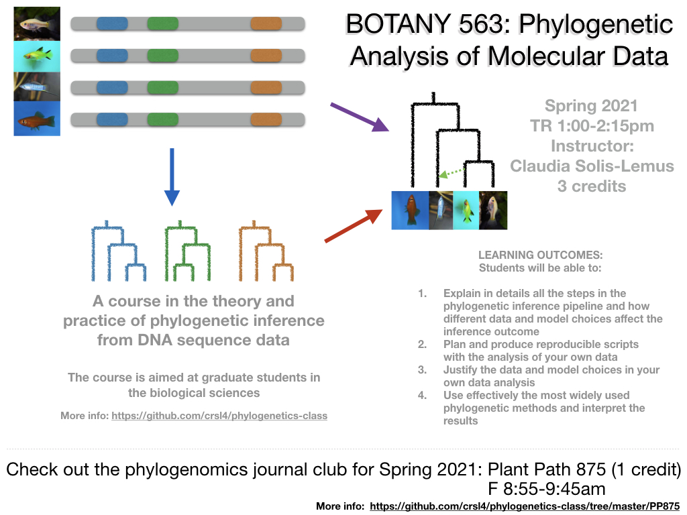

    

        <ul class="nav">
            <li><a href="#knowledge">useful links</a></li>
            <li><a href="#courses">courses</a></li>
            <li><a href="#tutorials">tutorials</a></li>
            <li><a href="#experience">past teaching</a></li>
            <li><a href="#mentoring">past mentoring</a></li>
        </ul>
    

## Useful links

#### Reprodubility, computing practices and open science
- My notes on [mindful programming](https://github.com/crsl4/mindful-programming/blob/master/lecture.md)
- Karl Broman's [notes](http://kbroman.org/Tools4RR/) on reproducible research
- Version control: [notes](https://uw-madison-aci.github.io/2018-01-10-uwmadison-swc/) from Software Carpentry at UW-Madison (there might be more recent notes out there)
- R Markdown: [The Definite Guide](https://bookdown.org/yihui/rmarkdown/)
- Rich Edwards (2015) [Bioinformatics is just like bench science and should be treated as such](http://cabbagesofdoom.blogspot.com/2015/08/bioinformatics-is-just-like-bench.html)
- Basic principles of data in spreadsheets [paper](https://www.tandfonline.com/doi/full/10.1080/00031305.2017.1375989)
- JSM 2020 [Panel on version control with git in stat cources](https://github.com/mdbeckman/JSM2020-Virtual)

#### Learning Julia
- Learn X in Y minutes: [julia](https://learnxinyminutes.com/docs/julia/)
- Julia for R programmmers: [cheatsheet](https://datascience-enthusiast.com/R/R_Julia_cheat_sheet.html)
- Julia for Python/Matlab programmers: [cheatsheet](https://cheatsheets.quantecon.org/)
- Julia for Data Science [workshop](https://github.com/crsl4/julia-workshop)

#### Learning Statistics
- Tukey (1962) [The future of data analysis](https://projecteuclid.org/euclid.aoms/1177704711)
- [StatQuest](https://www.youtube.com/c/joshstarmer/featured): YouTube channel with short videos to explain important concepts in Statistics and Data Science

---

## Courses

#### Summer 2021

- Virtual species delimitation workshop at the National Museum of Natural History (NMNH); August 16-19, 2021. [iBPP wiki](https://github.com/cecileane/iBPP/wiki)

#### Spring 2021

- Botany 563 Phylogenetic Analysis of Molecular Data: [website](https://github.com/crsl4/phylogenetics-class); 3 credits; TR 1:00-2:15pm (virtual over zoom)
- Plant Path 875 Readings in Phylogenomics: [website](https://github.com/crsl4/phylogenetics-class/tree/master/PP875); 1 credit; F 8:55-9:45am (virtual over zoom)

**Julia para Ciencias de Datos** organized by Seminario de Investigacion de la Escuela de Estadistica de la Universidad de Los Andes, Merida, Venezuela. [Github](https://github.com/crsl4/julia-workshop/blob/main/one-hour-spanish/lecture-notes.md)

**Julia workshop for Data Science** co-organized with Doug Bates for the [2021 Data Science Research Bazaar](https://datascience.wisc.edu/data-science-research-bazaar/) on February 10th, 2021. [GitHub](https://github.com/crsl4/julia-workshop)

#### Fall 2020
**Mexicanas en Ciencias de Datos:** Julia workshop for Data Science. [github](https://github.com/crsl4/julia-workshop)

#### 2019 
**Woods Hole:** Faculty member of the Marine Biological Laboratory workshop on Molecular Evolution. Lecture and tutorial on phylogenetic networks. Woods Hole, USA.
  - [slides](https://www.stat.wisc.edu/~claudia/talk-networks-mbl.pdf)
  - [wiki](https://github.com/crsl4/PhyloNetworks.jl/wiki)

#### 2016: 
**Botany 563:** Guest lecture on Introduction to phylogenetic networks
  - [slides](http://www.stat.wisc.edu/~claudia/networks_talkBotany.pdf)
  - [code](http://www.stat.wisc.edu/~claudia/smallTutorialBotany.jl)

---

## Tutorials

#### 2019
- **Nantucket developR:**
Tutorial on best computing practices using R: [mindful programming](https://github.com/crsl4/mindful-programming/blob/master/lecture.md). Notes from other instructors [here](https://github.com/NantucketDevelopeR/2019Workshop).

- **Molecular Evolution Workshop at Woods Hole:**
Tutorial on inference of phylogenetic networks using Julia package: [PhyloNetworks](https://github.com/crsl4/PhyloNetworks.jl/wiki). Links above in [Courses](https://solislemuslab.github.io//pages/teaching.html#courses).

#### 2016
- **Instituto de Biolog&iacute;a - UNAM:**
Introduction to PhyloNetworks and SNaQ: Same tutorial as in Evolution 2016, links below.

- **Evolution:**
Phylogenomics symposium and software school: Introduction to PhyloNetworks and SNaQ
  - [wiki](https://github.com/crsl4/PhyloNetworks.jl/wiki)
  - [julia code](http://www.stat.wisc.edu/~claudia/tutorial.jl)
  - [R code](http://www.stat.wisc.edu/~claudia/tutorial.r)

---

## Other teaching experience

#### Teaching Assistant ([UW-Madison](http://www.wisc.edu/))

- Summer 2014 PhD qualifier Summer camp
- Spring 2013 Introduction to Biostatistics for Population Health II (BIOSTAT 552) (professor [Ron Gangnon](https://www.biostat.wisc.edu/~ronald/))
- Fall 2012 Introduction to Biostatistics for Population Health I (BIOSTAT 551) (professor Ron Gangnon)
- Spring 2012 Introduction to Biostatistics for Population Health II (BIOSTAT 552) (professor Ron Gangnon)
- Fall 2011  Introduction to Biostatistics for Population Health I (BIOSTAT 551) (professor Ron Gangnon)
- Summer 2011 Introduction to Statistical Methods (STAT 301) (professor [Kam Wah Tsui](https://www.stat.wisc.edu/~kwtsui/))
- Spring 2011 Introduction to Statistical Methods (STAT 301) (professor [Kevin Packard](http://www.human.cornell.edu/bio.cfm?netid=kcp48))
- Fall 2010 Introduction to Theory and Methods of Mathematical Statistics I (STAT 311) (professor [Zhengjun Zhang](https://www.stat.wisc.edu/~zjz/))

#### Instructor ([ITAM](https://www.itam.mx/en))

- Summer 2010 Advanced Algebra
- Spring 2010 Calculus II
- Fall 2009 Calculus III
- Fall 2009 Actuarial Mathematics I
- Spring 2010 Actuarial Mathematics I
- Fall 2009 Actuarial Mathematics III
- Spring 2010 Actuarial Mathematics III

---

## Past Mentoring

For members of Solis-Lemus lab, see [People](https://solislemuslab.github.io//pages/people.html)

##### 2019 
- Software Development Project, **Fast reconstruction and visualization of phylogenetic networks**, Harnoor Singh and Naman Kanwar – Georgia State University.

##### 2018
- Software Development Project, **Julia package for GAMuT test**, [Anna Voss](https://github.com/avoss3) - Emory University
- Statistics Senior Honors Thesis, **GWAS data analysis for epilepsy**, Mengtong Hu - Emory University

##### 2016
- Software Development Project, **Parallelization of SNaQ
  in PhyloNetworks**, [Josh McGrath](https://github.com/josmcg) - University of Wisconsin-Madison
- Undergraduate Research Scholar, **Computing tools for
  bayesian phylogenetic inference**, [Jordan Vonderwell](https://github.com/JVonderwell) - University of Wisconsin-Madison
- Statistics Senior Honors Thesis, **Computing tools
  and performance of PhyloNetworks**, [Nan Ji](https://github.com/frupaul) - University of Wisconsin-Madison

##### 2015
- Statistics Senior Honors Thesis, **Inconsistency of species-tree methods under gene flow**, [Mengyao Yang](https://github.com/mengyaoyang) – University of Wisconsin-Madison
- Integrated Biological Sciences Summer Research Program, **Visualizing inferred phylogenetic networks in Julia**, [John Spaw](https://github.com/JohnPSpaw) – University of Wisconsin-Madison

##### 2014
- Integrated Biological Sciences Summer Research Program, **Using quartets to estimate phylogenetic networks**, John Malloy – University of Wisconsin-Madison.