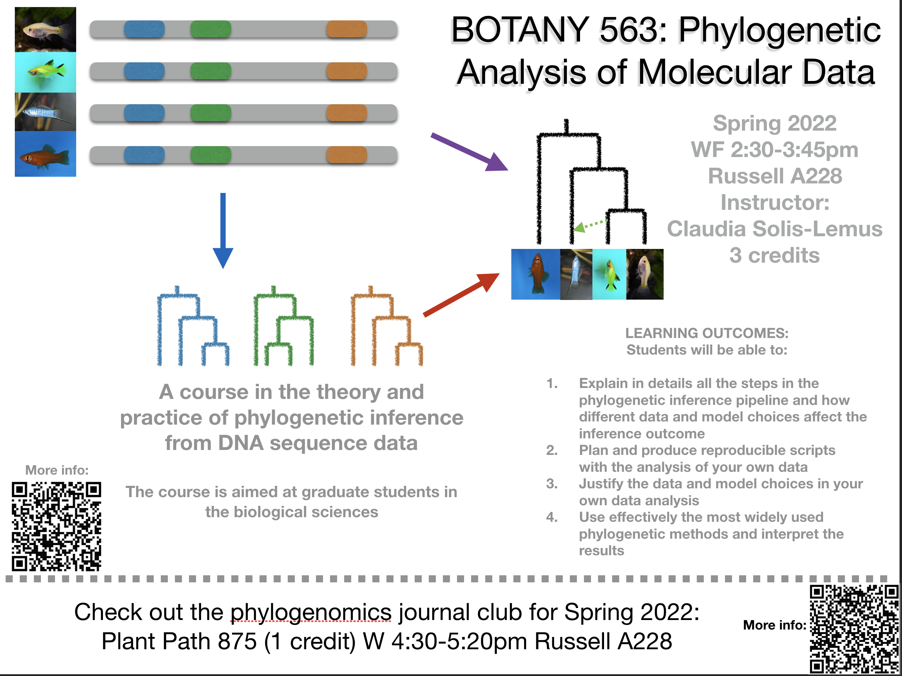
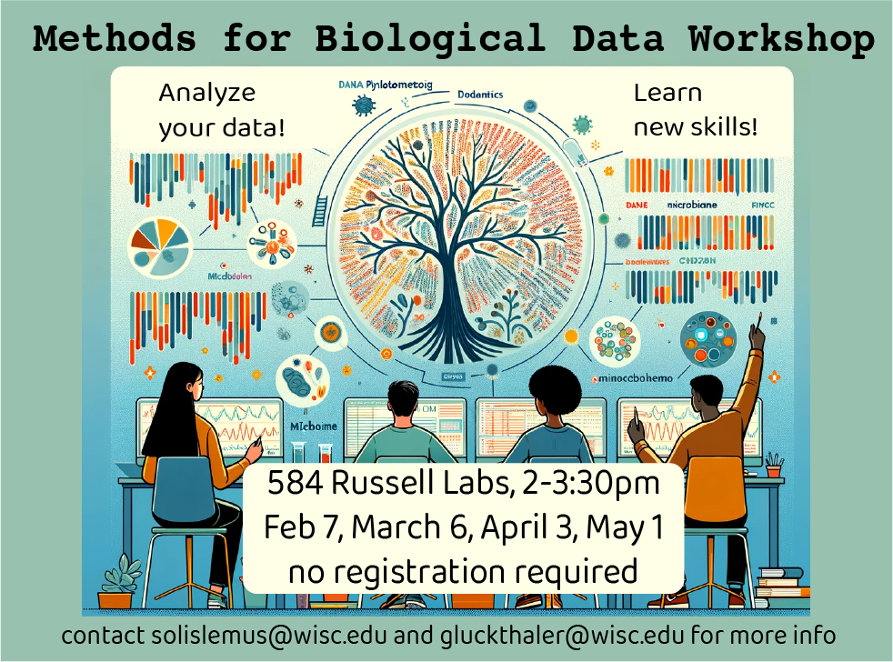

    

        <ul class="nav">
            <li><a href="#courses">uw courses</a></li>
            <li><a href="#workshops">workshops</a></li>
            <li><a href="#knowledge">useful links</a></li>
            <li><a href="https://solislemuslab.github.io//pages/consulting.html">get stat help!</a></li>
        </ul>
    

# Courses at UW-Madison

## Botany/PlantPath 563 Phylogenetic Analysis of Molecular Data
- Spring 2021: 3 credits; TR 1:00-2:15pm (virtual over zoom)
- Spring 2022: 3 credits; WF 2:30-3:45pm
- Spring 2023: 3 credits; TR 1:00-2:15pm
- [Spring 2024](https://crsl4.github.io/phylogenetics-class/): 3 credits; TR 1:00-2:15pm

## Plant Path 875 Readings in Phylogenomics
- Spring 2021: 1 credit; F 8:55-9:45am (virtual over zoom)
- [Spring 2022](https://github.com/crsl4/phylogenetics-class/tree/master/PP875): 1 credit; W 4:30-5:20pm

    

---

# Workshops

## Spring 2024

- Methods for Biological Data Workshop
  - [Website](https://crsl4.github.io/methods-bio-data-workshop/)

    

- Forensic Justice Institute 2024 by the State Bar of Wisconsin
  - [Website](https://crsl4.github.io/forensic-stat/)

## Fall 2023

- **Methodological advances in reticulate evolution** [Workshop](https://gtiley.github.io/RBG-Networks/) co-organized by George Tiley in Kew Botanical Garden, UK:
  - [SNaQ Tutorial](https://solislemuslab.github.io/snaq-tutorial/)

    

## Summer 2023

- **Taming the BEAST** Faculty member of the workshop on BEAST. Lecture on phylogenetic networks (taught by postdoc Sungsik Kong). Squamish, Canada.
  - [Slides](https://taming-the-beast.org/news/Taming-the-BEAST-SBT/)

    

- **Botany conference** Workshop on phylogenetic networks. Boise, Idaho.
  - [Website](https://gtiley.github.io/Botany2023-Networks/)

- **Molecular Evolution in MBL:** Lecture and tutorial on phylogenetic networks. Woods Hole, USA
  - [Schedule](https://molevolworkshop.github.io/schedule/)
  - [Materials](https://molevolworkshop.github.io/faculty-solis-lemus/)

## Spring 2023

- DNA Bootcamp 2023 by California State University Los Angeles, Los Angeles Innocence Project, Federal Defender Central District of California, and Los Angeles County Public Defender
  - [Website](https://crsl4.github.io/forensic-stat/)
  - [YouTube video](https://youtu.be/_SXVRD00vMY)

- Accessible reproducibility for biological researchers at the [Toronto Workshop on Reproducibility](https://rohanalexander.com/reproducibility.html)
  - [website](https://crsl4.github.io/mindful-programming/)
  - [wiki](https://github.com/crsl4/mindful-programming)

- **SSB Satellite Mexico City:** Introduction to PhyloNetworks.
  - [wiki](https://github.com/crsl4/PhyloNetworks.jl/wiki)

## Summer 2022

- [AI+Science Summer school](https://datascience.uchicago.edu/events/2022-ai-science-summer-school/): Deep learning in biology. University of Chicago. August 10, 2022.
  - [Toy implementation of Bayesian NN in Julia](https://github.com/crsl4/toy-bayesian-nn/blob/main/bayesian-nn.ipynb)

- **Woods Hole:** Faculty member of the Marine Biological Laboratory workshop on Molecular Evolution. Lecture and tutorial on phylogenetic networks. Woods Hole, USA.

- **Julia workshop for Data Science** co-organized with Doug Bates for [ISMB 2022](https://www.iscb.org/ismb2022-program/tutorials#ip5) on July 10th, 2022. [Website](https://crsl4.github.io/julia-workshop/), [GitHub](https://github.com/crsl4/julia-workshop)
- Statistics for Forensics 101 (National Forensic College): [website](https://crsl4.github.io/forensic-stat/)

## Spring 2022

- Introduction to Statistics for Defense Attorneys (WI public defenders): [website](https://crsl4.github.io/forensic-stat/)

## Fall 2021

**BME 780 Guest lecture:** Statistical phylogenomics
- Optional background reading: 
  - [HAL Chapter 2.1](https://hal.inria.fr/PGE/hal-02535366)
  - [Phylogenomics — principles, opportunities and pitfalls of big-data phylogenetics](https://onlinelibrary.wiley.com/doi/full/10.1111/syen.12406)
- Lecture notes (_Oct 26_): [slides](https://www.stat.wisc.edu/~claudia/lecture-phylo.pdf)
- Paper discussion (_Nov 3_): [Multispecies coalescent and its applications to infer species phylogenies and cross-species gene flow](https://academic.oup.com/nsr/advance-article/doi/10.1093/nsr/nwab127/6321855)
- Learn more about phylogenomics:
  - [HAL open access book](https://hal.inria.fr/PGE/page/table-of-contents) Chapters 1.1, 1.2, 1.4, 3.1 and 3.3
  - [Phylogenetic Trees and Networks Can Serve as Powerful and Complementary Approaches for Analysis of Genomic Data](https://academic.oup.com/sysbio/article/69/3/593/5552158?login=true)
  - Spring 2022 [Botany 563 Phylogenetic Analysis of Molecular Data](https://github.com/crsl4/phylogenetics-class)

**STAT 609/849 Guest lecture:** Statistical methods for biological applications (_Oct 19_)

## Summer 2021

**Virtual species delimitation workshop** at the National Museum of Natural History (NMNH); August 16-19, 2021. [iBPP wiki](https://github.com/cecileane/iBPP/wiki), [YouTube video](https://www.youtube.com/watch?v=_Q53Q8eKw48)

## Spring 2021

**Julia para Ciencias de Datos** organized by Seminario de Investigacion de la Escuela de Estadistica de la Universidad de Los Andes, Merida, Venezuela. [Github](https://github.com/crsl4/julia-workshop/blob/main/one-hour-spanish/lecture-notes.md)

**Julia workshop for Data Science** co-organized with Doug Bates for the [2021 Data Science Research Bazaar](https://datascience.wisc.edu/data-science-research-bazaar/) on February 10th, 2021. [GitHub](https://github.com/crsl4/julia-workshop)

## Fall 2020

**Mexicanas en Ciencias de Datos:** Julia workshop for Data Science. [github](https://github.com/crsl4/julia-workshop)

**STAT 609/849 Guest lecture:** Statistical methods for biological applications (_Oct 1_) 

## 2019 

**Nantucket developR:**
Tutorial on best computing practices using R: [mindful programming](https://github.com/crsl4/mindful-programming/blob/master/lecture.md). Notes from other instructors [here](https://github.com/NantucketDevelopeR/2019Workshop).

**Taming the BEAST** Faculty member of the workshop on BEAST. Lecture on phylogenetic networks. Squamish, Canada
  - [Slides](https://github.com/Taming-the-BEAST/Taming-the-BEAST-2019-Eh-Lectures)

    

**Woods Hole:** Faculty member of the Marine Biological Laboratory workshop on Molecular Evolution. Lecture and tutorial on phylogenetic networks. Woods Hole, USA.
  - [slides](https://www.stat.wisc.edu/~claudia/talk-networks-mbl.pdf)
  - [wiki](https://github.com/crsl4/PhyloNetworks.jl/wiki)

#### 2016: 
**Botany 563:** Guest lecture on Introduction to phylogenetic networks
  - [slides](http://www.stat.wisc.edu/~claudia/networks_talkBotany.pdf)
  - [code](http://www.stat.wisc.edu/~claudia/smallTutorialBotany.jl)

**Instituto de Biolog&iacute;a - UNAM:**
Introduction to PhyloNetworks and SNaQ: Same tutorial as in Evolution 2016, links below.

**Evolution:**
Phylogenomics symposium and software school: Introduction to PhyloNetworks and SNaQ
  - [wiki](https://github.com/crsl4/PhyloNetworks.jl/wiki)
  - [julia code](http://www.stat.wisc.edu/~claudia/tutorial.jl)
  - [R code](http://www.stat.wisc.edu/~claudia/tutorial.r)

---

# Useful links

## Reprodubility, computing practices and open science
- My notes on [mindful programming](https://github.com/crsl4/mindful-programming/blob/master/lecture.md) and accompanying [YouTube video](https://youtu.be/7KCqpL0cde8)
- Karl Broman's [notes](http://kbroman.org/Tools4RR/) on reproducible research
- Version control: [notes](https://uw-madison-aci.github.io/2018-01-10-uwmadison-swc/) from Software Carpentry at UW-Madison (there might be more recent notes out there)
- R Markdown: [The Definite Guide](https://bookdown.org/yihui/rmarkdown/)
- Rich Edwards (2015) [Bioinformatics is just like bench science and should be treated as such](http://cabbagesofdoom.blogspot.com/2015/08/bioinformatics-is-just-like-bench.html)
- Basic principles of data in spreadsheets [paper](https://www.tandfonline.com/doi/full/10.1080/00031305.2017.1375989)
- JSM 2020 [Panel on version control with git in stat cources](https://github.com/mdbeckman/JSM2020-Virtual)
- [Bioinformatics one-liners](https://github.com/stephenturner/oneliners)

## Learning Julia
- Learn X in Y minutes: [julia](https://learnxinyminutes.com/docs/julia/)
- Julia for R programmmers: [cheatsheet](https://datascience-enthusiast.com/R/R_Julia_cheat_sheet.html)
- Julia for Python/Matlab programmers: [cheatsheet](https://cheatsheets.quantecon.org/)
- Julia for Data Science [workshop](https://github.com/crsl4/julia-workshop)
- [How to create a Julia package](https://jaantollander.com/post/how-to-create-software-packages-with-julia-language/)

## Learning Statistics
- Tukey (1962) [The future of data analysis](https://projecteuclid.org/euclid.aoms/1177704711)
- [StatQuest](https://www.youtube.com/c/joshstarmer/featured): YouTube channel with short videos to explain important concepts in Statistics and Data Science

---

# Other teaching experience

## Teaching Assistant ([UW-Madison](http://www.wisc.edu/))

- Summer 2014 PhD qualifier Summer camp
- Spring 2013 Introduction to Biostatistics for Population Health II (BIOSTAT 552) (professor [Ron Gangnon](https://www.biostat.wisc.edu/~ronald/))
- Fall 2012 Introduction to Biostatistics for Population Health I (BIOSTAT 551) (professor Ron Gangnon)
- Spring 2012 Introduction to Biostatistics for Population Health II (BIOSTAT 552) (professor Ron Gangnon)
- Fall 2011  Introduction to Biostatistics for Population Health I (BIOSTAT 551) (professor Ron Gangnon)
- Summer 2011 Introduction to Statistical Methods (STAT 301) (professor [Kam Wah Tsui](https://www.stat.wisc.edu/~kwtsui/))
- Spring 2011 Introduction to Statistical Methods (STAT 301) (professor [Kevin Packard](http://www.human.cornell.edu/bio.cfm?netid=kcp48))
- Fall 2010 Introduction to Theory and Methods of Mathematical Statistics I (STAT 311) (professor [Zhengjun Zhang](https://www.stat.wisc.edu/~zjz/))

## Instructor ([ITAM](https://www.itam.mx/en))

- Summer 2010 Advanced Algebra
- Spring 2010 Calculus II
- Fall 2009 Calculus III
- Fall 2009 Actuarial Mathematics I
- Spring 2010 Actuarial Mathematics I
- Fall 2009 Actuarial Mathematics III
- Spring 2010 Actuarial Mathematics III

---

# Mentoring before Solis-Lemus lab

For members of Solis-Lemus lab, see [Team](https://solislemuslab.github.io//pages/people.html)

##### 2019 
- Software Development Project, **Fast reconstruction and visualization of phylogenetic networks**, Harnoor Singh and Naman Kanwar – Georgia State University.

##### 2018
- Software Development Project, **Julia package for GAMuT test**, [Anna Voss](https://github.com/avoss3) - Emory University
- Statistics Senior Honors Thesis, **GWAS data analysis for epilepsy**, Mengtong Hu - Emory University

##### 2016
- Software Development Project, **Parallelization of SNaQ
  in PhyloNetworks**, [Josh McGrath](https://github.com/josmcg) - University of Wisconsin-Madison
- Undergraduate Research Scholar, **Computing tools for
  bayesian phylogenetic inference**, [Jordan Vonderwell](https://github.com/JVonderwell) - University of Wisconsin-Madison
- Statistics Senior Honors Thesis, **Computing tools
  and performance of PhyloNetworks**, [Nan Ji](https://github.com/frupaul) - University of Wisconsin-Madison

##### 2015
- Statistics Senior Honors Thesis, **Inconsistency of species-tree methods under gene flow**, [Mengyao Yang](https://github.com/mengyaoyang) – University of Wisconsin-Madison
- Integrated Biological Sciences Summer Research Program, **Visualizing inferred phylogenetic networks in Julia**, [John Spaw](https://github.com/JohnPSpaw) – University of Wisconsin-Madison

##### 2014
- Integrated Biological Sciences Summer Research Program, **Using quartets to estimate phylogenetic networks**, John Malloy – University of Wisconsin-Madison.