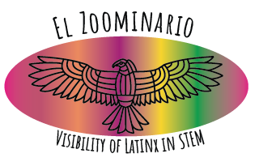

    

        <ul class="nav">
            <li><a href="#faq">faq</a></li>
            <li><a href="https://www.tiktok.com/@latinxinstem">tiktok</a></li>
            <li><a href="https://www.youtube.com/playlist?list=PL1AfUDnwvYbOA9rfrvyA2nR9SR0VYbklx">youtube</a></li>
        </ul>
    

    

    

| Date | Country | Speaker | Title | YouTube | TikTok | Who am I? |
| :---   | :--- | :--- | :---  | :--- | :--- |
| 2 Oct 2020 |  | Daniel Pimentel-Alarcon | Machine-learning, inside the black-box  | |  | |
| 6 Nov 2020 |  | Jose Alonso Solis-Lemus | Supporting 2 patients with 1 ventilator | |  | |
| 4 Dec 2020 |  | Rosana Zenil-Ferguson | Impact of polyploidy and biome on fern diversification | | | |
| 8 Jan 2021 |  | Claudia Solis-Lemus | Learning the Tree of Life | |  |  |
| 5 Feb 2021 |  | Helena Jaramillo-Mesa | Unraveling protein production mechanisms in plant viruses | |  |
| 5 Mar 2021 |  | Maria Gracia Garcia | Immune cell interactions with imaging flow cytometry | | |
| 2 Apr 2021 |  | Quimi Vidaurre | Fungi and fungus-farming insects: friends and enemies | |  |
| 7 May 2021 |  | Fabricia Nascimento | Simulation framework for HIV epidemics | |  |
| 4 Jun 2021 |  | Vianey Leos Barajas | Latent structures in ecological and environmental data | |  |
| 2 Jul 2021 |  | Ariadna Gonzalez-Solis | Plant membrane lipids, a tale of life and death | |  |
| 6 Aug 2021 |  | Victor Zavala | Sustainability Challenges in the Dairy Industry | |  |
| 3 Sep 2021 |  | Stephanie Colon-Santos | Looking for life: A quest into the Origins of life and Astrobiology ||  |
| 5 Nov 2021 |   | Fernando Campos | Hasta la vista, baby! Terminating Cardiac Arrhythmias with Computer Simulations | |  | |
| 7 Jan 2022 |  | Ana Salgado | Ecological implications of host plant quality for herbivorous insects | |  |  |
| 4 Feb 2022 |  | Miguel Reyes | Does stress help us adapt and survive? | |  |
| 1 Apr 2022 |  | Juliana Gonzalez Tobon  | What makes potatoes sick? | |  |
| 6 May 2022 |  | Adriana Romero-Olivares | Fungal responses to climate change and consequences to our ecosystems | |  |  |
| 3 Jun 2022 |  | Rene Flores Garcia | Emulating a Pulsar in BRB | |  |
| 1 Jul 2022 |  | Nayomi Plaza Rodriguez | Elucidating the nanoscale interactions between wood and water | |  |
| 5 Aug 2022 |  | Diana Tabima Martinez | Engineering a small diameter vascular graft | |  |  |
| 2 Sep 2022 |  | Laura Muñoz Baena | Less Is More: How Viruses Evolve Compact Genomes |  |  |
| 7 Oct 2022 |  | Natalia Rosario-Melendez | Bacterial languages: Communication in a multispecies microbial community |  |  |
| 4 Nov 2022 | Ambar Carvallo Lopez | |
| 2 Dec 2022 | Jesus Arroyo Relion | |
| 6 Jan 2023 | Daniel Ojeda-Juarez | |
| 3 Feb 2023 | Brenda Betancourt | |
| 3 Mar 2023 | Federico Rey | |
| 7 Apr 2023 | Pablo Moreno-Yaeger | |
| 5 May 2023 |  | |
| 2 Jun 2023 |  | |
| 7 Jul 2023 |  | |
| 4 Aug 2023 |  | |
| 1 Sep 2023 |  | |
| 6 Oct 2023 |  | |
| 3 Nov 2023 |  | |
| 1 Dec 2023 |  | |

# FAQ

**What is El Zoominario?**
It is a seminar series of scientific short talks (in English) given by Latinx in STEM. The goal is to increase visibility of Latinx people in STEM and inspire the next generation of Latinx scientists. The talks are meant to be accessible to the general audience.

**What is the format of the talks?**
The talks are 15-20 minutes long of a scientific topic explained in accessible terms to a broad audience. At the end of the talk, the speaker chooses to share interesting facts about their Latinx culture.

**How can I watch?**
Currently, live attendance is restricted to people at UW-Madison and close collaborators. Anybody can watch the recorded talks in the [youtube channel](https://www.youtube.com/playlist?list=PL1AfUDnwvYbOA9rfrvyA2nR9SR0VYbklx).

**I am at UW-Madison, how can I watch the talks live?**
You need to join the UW google group "el-zoominario" (or email me) to be added to the mailing list. Emails to the group will contain login information.

**Why are the youtube comments disabled?**
Currently, we do not have the time to guarantee that all comments will be polite, respectful and family-friendly. Since we want to make these talks accessible to any audience, we prefer to block comments for now.

**I want to give a talk or nominate someone to give a talk?**
Great! Please fill out [this google form](https://forms.gle/1kpZE1XrKe9YS9cHA).