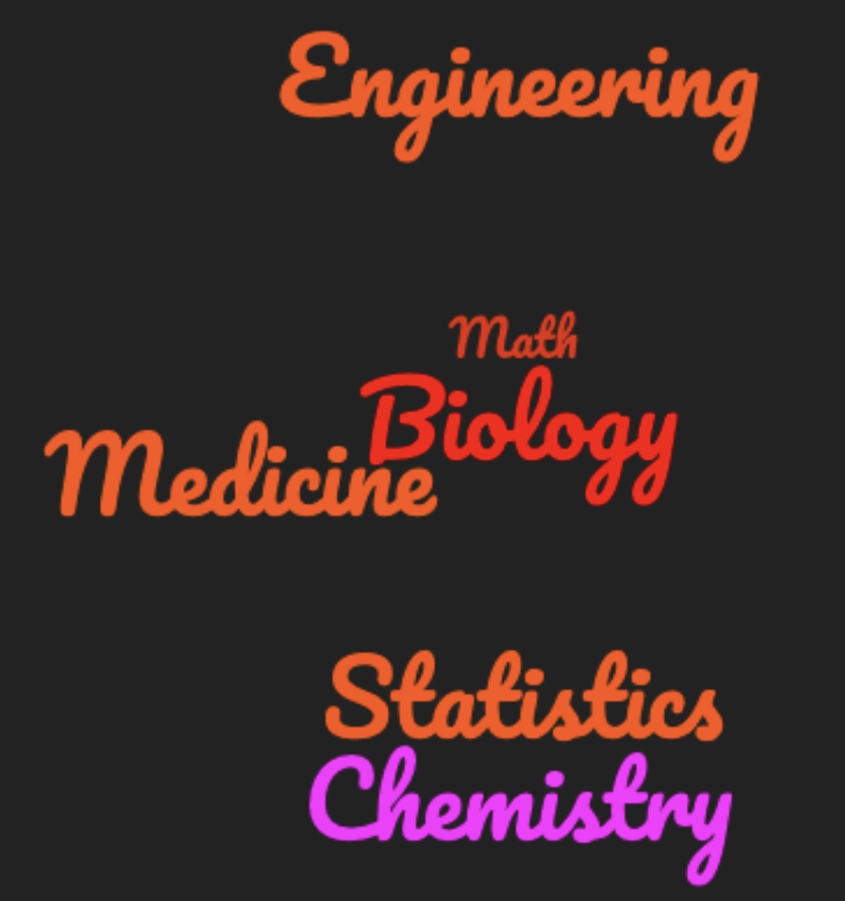
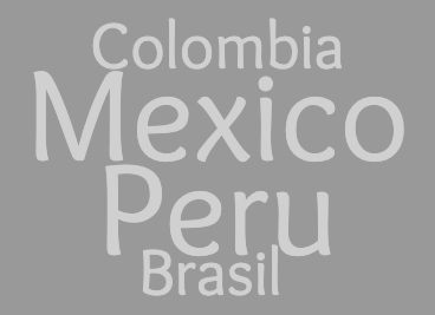

**What is El Zoominario?**
It is a seminar series of scientific short talks (in English) given by Latinx in STEM. The goal is to increase visibility of Latinx people in STEM and inspire the next generation of Latinx scientists. The talks are meant to be accessible to the general audience.

**What is the format of the talks?**
The talks are 15-20 minutes long of a scientific topic explained in accessible terms to a broad audience. At the end of the talk, the speaker chooses to share interesting facts about their Latinx culture

**How can I watch?**
Currently, live attendance is restricted to people at UW-Madison and close collaborators. Anybody can watch the recorded talks in the [youtube channel](https://www.youtube.com/playlist?list=PL1AfUDnwvYbOA9rfrvyA2nR9SR0VYbklx)

**I am at UW-Madison, how can I watch the talks live?**
You need to join the UW google group "el-zoominario" (or email me) to be added to the mailing list. Emails to the group will contain login information

**Why are the youtube comments disabled?**
Currently, we do not have the manpower to guarantee that all comments will be polite, respectful and family-friendly. Since we want to make these talks accessible to any audience, we prefer to block comments for now

**I want to give a talk or nominate someone to give a talk?**
Great! Please fill out [this google form](https://forms.gle/1kpZE1XrKe9YS9cHA)

### Talks topics and countries

    
    

### Schedule

| Date | Speaker | Title (YouTube link) | 
| :---   | :--- | :--- | :---       |
| 2 October 2020 | Daniel Pimentel-Alarcon 🇲🇽 | [Machine-learning, inside the black-box](https://youtu.be/W1zxOj6895I) |
| 6 November 2020 | Jose Alonso Solis-Lemus 🇲🇽 | [Supporting 2 patients with 1 ventilator](https://youtu.be/MeFT0wUmkvw) |
| 4 December 2020 | Rosana Zenil-Ferguson 🇲🇽 | [Impact of polyploidy and biome on fern diversification](https://youtu.be/6H9z6vuKWfo) |
| 8 January 2021 | Claudia Solis-Lemus 🇲🇽 | [Learning the Tree of Life](https://youtu.be/lAP8kpPa288) |
| 5 February 2021 | Helena Jaramillo-Mesa 🇨🇴 | [Unraveling protein production mechanisms in plant viruses](https://youtu.be/wQuC_b4iI5M) |
| 5 March 2021 | Maria Gracia Garcia 🇵🇪 | [Immune cell interactions with imaging flow cytometry](https://youtu.be/rma1IKDy4Fk) |
| 2 April 2021 | Quimi Vidaurre 🇵🇪 | [Fungi and fungus-farming insects: friends and enemies](https://youtu.be/0lOztN-X0HU) |
| 7 May 2021 | Fabricia Nascimento 🇧🇷 | [Simulation framework for HIV epidemics](https://youtu.be/6hr47tzxihw) |
| 4 June 2021 | Vianey Leos Barajas 🇲🇽 | [Latent structures in ecological and environmental data](https://youtu.be/RZ1StdDDFFU) |
| 2 July 2021 | Ariadna Gonzalez-Solis 🇲🇽 | [Plant membrane lipids, a tale of life and death](https://youtu.be/8_BDS0_YHFY) |
| 6 August 2021 | Victor Zavala 🇲🇽 | [Sustainability Challenges in the Dairy Industry](https://www.youtube.com/watch?v=0NxHs_YeHsI) |
| 3 September 2021 | Stephanie Colon-Santos 🇵🇷 | [Looking for life: A quest into the Origins of life and Astrobiology](https://www.youtube.com/watch?v=NdSkt3ZYqLU)|
| 5 November 2021 | Fernando Campos 🇧🇷 | [Hasta la vista, baby! Terminating Cardiac Arrhythmias with Computer Simulations](https://youtu.be/2wV4TRjUp90) |
| 7 January 2022 | Ana Salgado 🇪🇨 | [Ecological implications of host plant quality for herbivorous insects](https://youtu.be/mWunY10j_Cg) |
| 4 February 2022 | Miguel Reyes 🇲🇽 | [Does stress help us adapt and survive?](https://youtu.be/gwM-z79vOYU) |
| 1 April 2022 | Juliana Gonzalez Tobon 🇨🇴 | [What makes potatoes sick?](https://youtu.be/shf6BoJdgnM) |
| 6 May 2022 | Adriana Romero-Olivares 🇲🇽 | [Fungal responses to climate change and consequences to our ecosystems](https://youtu.be/qA8V0M4T6Sc) |
| 3 June 2022 | Rene Flores Garcia 🇲🇽 | [Emulating a Pulsar in BRB](https://youtu.be/wc1Yr5N_jA0) |
| 1 July 2022 | Nayomi Plaza Rodriguez 🇵🇷 | [Elucidating the nanoscale interactions between wood and water](https://youtu.be/4UhqhPHb0z8) |
| 5 August 2022 | Marcela Tabima Martinez 🇨🇴 | [Engineering a small diameter vascular graft](https://youtu.be/_VN90TWkQnQ) |
| 2 September 2022 | Laura Muñoz Baena | |
| 7 October 2022 | Natalia Rosario-Melendez | |
| 4 November 2022 |  | |
| 2 December 2022 |  | |